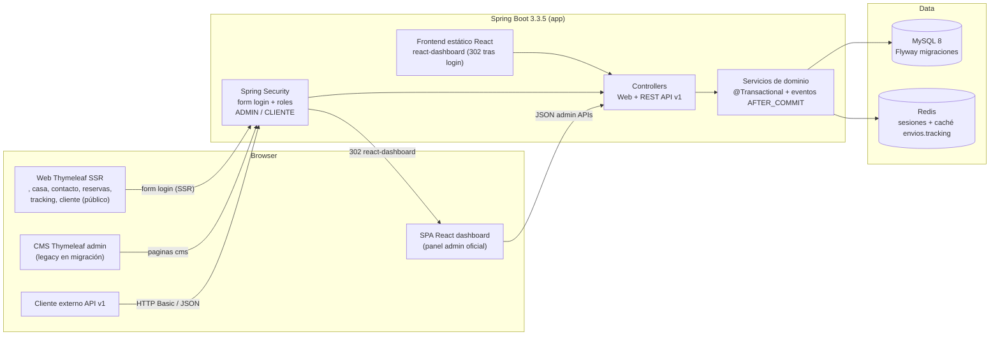

# Arquitectura de Interfaces — Envios_Paraguay_CMS

**Estado:** Vigente (actualizado el 2026-08-10, hito P2.2).
**Referencias:** `docs/superpowers/specs/2026-08-10-arquitectura-interfaces-thymeleaf-react-design.md`,
`docs/HARDENING_BACKLOG_ENVIOS_CMS.md` (P2.2, cerrado), `docs/README_DOCS.md` (índice de documentación).

Documenta la clasificación de las interfaces de la aplicación y la hoja de ruta de migración
del CMS Thymeleaf a la SPA React.

---

## 0. Diagrama de arquitectura híbrida (oficial)

Vista de alto nivel: una sola aplicación Spring Boot sirve la SPA React y el SSR Thymeleaf,
compartiendo sesión Spring Security (`JSESSIONID`), con MySQL como base de datos relacional y
Redis para sesiones distribuidas y caché.

**Notas de lectura:**

- El navegador entra por la SPA (oficial) o por la web pública (SSR); el login resuelve la sesión
  en Spring Security y redirige la SPA a `/react-dashboard/`.
- El CMS `/admin/**` sigue sirviendo `cms/*.html` mientras la migración F1–F6 no complete cada
  pantalla equivalente en React (ver sección 3).
- Las APIs `/api/v1/**` sirven a la SPA, al portal y a clientes externos bajo el mismo `SecurityConfig`.

---

## 1. Matriz de interfaces (oficial / legacy / complementaria)

| Interfaz | Estatus | Justificación |
|---|---|---|
| SPA React `/dashboard` | **Oficial** | Panel admin moderno: envíos, filtros, analytics, PWA/offline. Sesión Spring compartida. |
| Web pública `/`, `/casa`, `/contacto`, `/reservas`, `/operaciones`, legales | **Oficial** | Cara pública del negocio; Thymeleaf es el stack correcto para SSR/SEO. |
| Portal tracking `/tracking` | **Oficial** | Rastreo público en línea con la marca; Thymeleaf moderno. |
| Zona cliente `/cliente` | **Oficial** | Login propio por `clienteId`; panel con dashboard cacheado y etiqueta PDF. |
| Login `/login` | **Complementaria** | Soporta ambos flujos (form clásico y login React) mediante la misma sesión. |
| CMS `/admin/**` | **Legacy en migración** | Gestión de contenido/reservas sin equivalente React aún; se depreca por fases. |
| APIs `/api/v1/**` | **Oficial** | Contrato de datos para SPA, portal y clientes. |

## 2. Autenticación compartida

No hay JWT. La SPA React comparte la sesión **Spring Security** vía cookie `JSESSIONID`.

- `GET /login` con sesión admin válida → `302 /react-dashboard/`.
- `GET /login` con sesión de cliente o anónimo → template `login.html`.
- `POST /login` correcto → `302 /react-dashboard/` (`defaultSuccessUrl`).
- `GET /admin/dashboard` con sesión admin → `302 /react-dashboard/`; anónimo → `302 /login`.
- Resto de `/admin/**` con sesión → sigue sirviendo `cms/*.html`.

## 3. Hoja de migración CMS → SPA (fases F1–F6)

| Fase | Contenido | Equivalente React | Estado |
|---|---|---|---|
| F1 | Envíos, tracking, detalle, analytics, export | `AdminDashboard`, `ShipmentDetailPage`, APIs `/api/v1/admin/*` | **Hecho (P2.3)** |
| F2 | Importación batch (CSV) y su monitorización | Nueva página React sobre `BatchImportController` | Pendiente |
| F3 | Documentos / evidencias | Nueva página React sobre `DocumentosController`/`EntregaEvidenciaController` | Pendiente |
| F4 | Reservas y contactos (mensajes) | Nueva página React sobre `ReservaApiController` | Pendiente |
| F5 | Imágenes (galería) y textos legales | Nueva página React sobre `AdminApiController` | Pendiente |
| F6 | Deprecación: `/admin/**` → redirect total a `/dashboard` + borrado de templates `cms/*.html` | — | Pendiente |

## 4. Reglas de convivencia

- Ninguna funcionalidad del CMS se bloquea durante la migración.
- Cada fase añade su equivalente React y **solo entonces** la ruta `/admin/**` correspondiente
  pasa a legacy inaccesible.
- El banner **"Interfaz heredada"** (`.legacy-banner` en `admin-sidebar.html`) indica el
  estatus actual en todas las páginas `cms/*.html`. Su CSS es autocontenido.
- No se redirigen en bloque todas las rutas `/admin/**`: reservas, mensajes, imágenes, textos,
  imports y documentos aún no tienen pantalla React.

## 5. Observaciones de pulido visual (fuera de P2.2)

- Hallazgo **H8** (commit `e72def6`): `design-system.css` no contiene `.sidebar`, `.nav-links`,
  `.main-content`, `.btn-logout` ni `.logout-form`. Regresión previa documentada en el backlog;
  pendiente para un futuro bloque de pulido visual.
