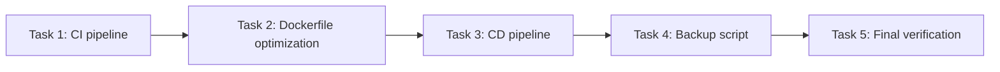

# Bloque 6: CI/CD Pipeline & Docker Optimization — Implementation Plan

> **For agentic workers:** REQUIRED SUB-SKILL: Use superpowers:subagent-driven-development (recommended) or superpowers:executing-plans to implement this plan task-by-task. Steps use checkbox (`- [ ]`) syntax for tracking.

**Goal:** Implement GitHub Actions CI (MySQL + Flyway tests), CD (auto-deploy to Koyeb), and Docker optimizations (BuildKit cache, healthcheck fix, multi-platform, backup).

**Architecture:** Two GitHub Actions workflows (`ci.yml`, `deploy-koyeb.yml`) + Dockerfile fixes + backup script. CI runs full test suite against MySQL 8.0 service container. CD builds multi-platform image, pushes to GHCR, deploys to Koyeb.

**Tech Stack:** GitHub Actions, Docker Buildx, GHCR, Koyeb CLI, Maven, Spring Boot 3.3.5

## Global Constraints

- All 47/47 existing tests must keep passing
- No Docker Compose services changes — only Dockerfile + docker-compose healthcheck
- `.env` secrets must NOT be committed to Git
- CD must only deploy after successful CI
- Koyeb API token stored as GitHub secret (`KOYEB_API_TOKEN`)
- GitHub Container Registry (GHCR) used for image storage

## Task Dependencies



---

### Task 1: GitHub Actions CI Pipeline

**Description:** Create `.github/workflows/ci.yml` that runs the full test suite with MySQL 8.0 service container and Flyway validate.

**Files:**
- Create: `.github/workflows/ci.yml`
- Modify: (none)

**Workflow spec:**
```yaml
name: CI
on:
  push:
    branches: [feature/seguimiento-premium]
  pull_request:
    branches: [main]
jobs:
  test:
    runs-on: ubuntu-latest
    services:
      mysql:
        image: mysql:8.0
        env:
          MYSQL_ROOT_PASSWORD: root
          MYSQL_DATABASE: envios_paraguay_cms_test
          MYSQL_USER: test_user
          MYSQL_PASSWORD: test_pass
        ports:
          - 3306:3306
        options: --health-cmd "mysqladmin ping -h localhost" --health-interval 10s --health-timeout 5s --health-retries 5
    steps:
      - uses: actions/checkout@v4
      - uses: actions/setup-java@v4
        with:
          java-version: 17
          distribution: temurin
          cache: maven
      - name: Run tests
        run: mvn test -B
        env:
          SPRING_DATASOURCE_URL: jdbc:mysql://localhost:3306/envios_paraguay_cms_test?useSSL=false&serverTimezone=UTC&allowPublicKeyRetrieval=true
          DB_USERNAME: test_user
          DB_PASSWORD: test_pass
      - name: Upload test reports
        if: always()
        uses: actions/upload-artifact@v4
        with:
          name: test-reports
          path: target/surefire-reports/
```

**Interfaces:**
- Consumes: MySQL 8.0 on `localhost:3306`
- Produces: CI check (green/red) on every PR and push
- Env vars set at step level override application.properties

**Validation:**
- Push to branch should trigger workflow
- MySQL container healthcheck must pass before tests run
- `mvn test` connects to MySQL, runs Flyway migration + validate, executes all 47 tests

---

### Task 2: Dockerfile Optimization

**Description:** Optimize Dockerfile with BuildKit cache mounts, fix healthcheck (curl → wget), add HEALTHCHECK instruction directly in Dockerfile.

**Files:**
- Modify: `Dockerfile`

**Changes:**

1. **BuildKit cache for Maven:**
   ```dockerfile
   RUN --mount=type=cache,target=/root/.m2 mvn dependency:go-offline -B
   ```
   ```dockerfile
   RUN --mount=type=cache,target=/root/.m2 mvn package -DskipTests -q
   ```

2. **Move HEALTHCHECK from docker-compose.yml into Dockerfile:**
   ```dockerfile
   HEALTHCHECK --interval=30s --timeout=10s --start-period=40s --retries=3 \
     CMD wget -qO- http://localhost:8080/actuator/health || exit 1
   ```

3. **Remove the healthcheck from docker-compose.yml** `app` service (since it's now in the Dockerfile).

**Validation:**
- `docker build -t monteastur-app .` succeeds
- `docker run monteastur-app` shows healthy status after ~40s
- Second rebuild uses cached Maven dependencies (< 30s)

---

### Task 3: GitHub Actions CD Pipeline

**Description:** Create `.github/workflows/deploy-koyeb.yml` that builds multi-platform image, pushes to GHCR, and deploys to Koyeb.

**Files:**
- Create: `.github/workflows/deploy-koyeb.yml`

**Workflow spec:**
```yaml
name: Deploy to Koyeb

on:
  push:
    branches: [feature/seguimiento-premium]

jobs:
  deploy:
    runs-on: ubuntu-latest
    steps:
      - uses: actions/checkout@v4

      - name: Set up Docker Buildx
        uses: docker/setup-buildx-action@v3

      - name: Login to GHCR
        uses: docker/login-action@v3
        with:
          registry: ghcr.io
          username: ${{ github.actor }}
          password: ${{ secrets.GITHUB_TOKEN }}

      - name: Extract metadata
        id: meta
        uses: docker/metadata-action@v5
        with:
          images: ghcr.io/${{ github.repository }}
          tags: |
            type=sha,format=short
            type=raw,value=latest

      - name: Build and push
        uses: docker/build-push-action@v5
        with:
          context: .
          platforms: linux/amd64,linux/arm64
          push: true
          tags: ${{ steps.meta.outputs.tags }}
          cache-from: type=gha
          cache-to: type=gha,mode=max

      - name: Install Koyeb CLI
        run: |
          curl -fsSL https://raw.githubusercontent.com/koyeb/koyeb-cli/master/install.sh | sh
          echo "$HOME/.koyeb/bin" >> $GITHUB_PATH

      - name: Deploy to Koyeb
        run: |
          koyeb login --token ${{ secrets.KOYEB_API_TOKEN }}
          koyeb service update monteastur-envios/app \
            --image ghcr.io/${{ github.repository }}:latest \
            --docker-args "--pull always"
```

**Interfaces:**
- Consumes: GITHUB_TOKEN (auto), KOYEB_API_TOKEN (must be configured in GitHub Secrets)
- Produces: Docker image at `ghcr.io/<owner>/<repo>:<sha>` and `:latest`
- Gates: Only runs on push to `feature/seguimiento-premium`

**Validation:**
- Push builds multi-platform image
- Image appears in GHCR packages
- Koyeb receives deploy request (verify via Koyeb dashboard)

---

### Task 4: MySQL Backup Script

**Description:** Create `scripts/backup-mysql.sh` — a shell script that dumps the MySQL database, compresses it, and rotates backups older than 30 days.

**Files:**
- Create: `scripts/backup-mysql.sh`

**Script spec:**
```bash
#!/bin/bash
# Monteastur Envios — MySQL Backup Script
# Usage: ./scripts/backup-mysql.sh
# Scheduled via host cron or Docker cron container

set -euo pipefail

BACKUP_DIR="${BACKUP_DIR:-./backup}"
DB_HOST="${DB_HOST:-localhost}"
DB_PORT="${DB_PORT:-3306}"
DB_USER="${DB_USER:-app_user}"
DB_PASSWORD="${DB_PASSWORD:-changeme_app}"
DB_NAME="${DB_NAME:-envios_paraguay_cms}"
RETENTION_DAYS="${RETENTION_DAYS:-30}"
TIMESTAMP=$(date +%Y%m%d_%H%M%S)
FILENAME="${BACKUP_DIR}/${DB_NAME}_${TIMESTAMP}.sql.gz"

mkdir -p "${BACKUP_DIR}"

mysqldump -h "${DB_HOST}" -P "${DB_PORT}" -u "${DB_USER}" \
  -p"${DB_PASSWORD}" "${DB_NAME}" \
  --single-transaction --routines --triggers --events \
  | gzip > "${FILENAME}"

echo "Backup created: ${FILENAME} ($(du -h "${FILENAME}" | cut -f1))"

# Rotate old backups
find "${BACKUP_DIR}" -name "${DB_NAME}_*.sql.gz" -mtime +"${RETENTION_DAYS}" -delete
echo "Cleaned backups older than ${RETENTION_DAYS} days"
```

**Interfaces:**
- Consumes: MySQL connection env vars
- Produces: `.sql.gz` file in `BACKUP_DIR`
- No Docker/CI integration — run on host via cron `0 2 * * *`

**Validation:**
- `chmod +x scripts/backup-mysql.sh`
- Run against local MySQL: produces valid `.sql.gz`
- `gunzip -c backup/*.sql.gz | head` shows valid SQL

---

### Task 5: Final Verification

**Description:** Verify all changes work together — CI triggers, Docker builds, backup script runs.

**Steps:**

1. **Git status check:** Ensure no unintended files staged
2. **Docker build test:** `docker build -t monteastur-app .` succeeds and finishes quickly (cached)
3. **Docker healthcheck test:** `docker run --rm -d -p 8080:8080 monteastur-app` → wait 45s → `docker ps` shows healthy
4. **GitHub Actions simulation:** Verify `ci.yml` syntax with `action-validator` or manual review
5. **Backup script test:** Run `scripts/backup-mysql.sh` against local MySQL
6. **Full test suite:** `mvn test` passes 47/47
7. **Commit all changes** with descriptive message

**Validation:**
- `docker build` < 60s with cache
- Container healthcheck passes (status: healthy)
- Backup script produces valid dump
- All 47/47 tests pass
- No secrets or `.env` committed

---

## Rollback Plan

If any task causes issues:
- **CI pipeline:** Revert `.github/workflows/ci.yml`
- **Docker:** Revert `Dockerfile` changes, restore original from git
- **CD pipeline:** Revert `.github/workflows/deploy-koyeb.yml`
- **Backup script:** Remove `scripts/backup-mysql.sh`

## Commit Strategy

One commit per task, prefixed:
- `Task 1:` → `feat(ci): add GitHub Actions CI pipeline with MySQL container`
- `Task 2:` → `feat(docker): optimize Dockerfile with BuildKit cache and fix healthcheck`
- `Task 3:` → `feat(ci): add GitHub Actions CD pipeline to deploy to Koyeb`
- `Task 4:` → `feat(scripts): add MySQL backup script with rotation`
- `Task 5:` → final commit (if fixes needed) or commit as part of Task 4
