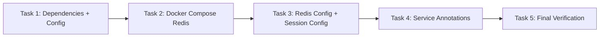

# Bloque 7: Redis Caching & Distributed Sessions — Implementation Plan

> **For agentic workers:** REQUIRED SUB-SKILL: Use superpowers:subagent-driven-development (recommended) or superpowers:executing-plans to implement this plan task-by-task. Steps use checkbox (`- [ ]`) syntax for tracking.

**Goal:** Integrate Redis as a caching layer for frequent DB queries and as a distributed HTTP session store, using Spring Cache abstraction and Spring Session Data Redis.

**Architecture:** Spring Cache abstraction (`@Cacheable`/`@CacheEvict`) with `RedisCacheManager`. Five cache regions with distinct TTLs. HTTP sessions stored in Redis via `@EnableRedisHttpSession`.

**Tech Stack:** Spring Boot 3.3.5, Redis 7 Alpine, Spring Data Redis, Spring Session Data Redis, Lettuce

## Global Constraints

- All 47/47 existing tests must keep passing
- No changes to controller layer — annotation changes only in services
- `@EnableRedisHttpSession` must not break existing security flow
- Existing `.env` variables must continue to work
- Build must succeed without Redis running (graceful fallback to DB)
- Use `GenericJackson2JsonRedisSerializer` for cache values
- Use `spring-session-data-redis` default `JdkSerializationRedisFactory` for sessions

## Task Dependencies



---

### Task 1: Dependencies + Configuration

**Description:** Add Redis + Spring Session dependencies to `pom.xml` and configure application properties.

**Files:**
- Modify: `pom.xml`
- Modify: `src/main/resources/application.properties`
- Modify: `src/main/resources/application-prod.properties`
- Modify: `.env.example`
- Modify: `.env`

**pom.xml changes:**
```xml
<dependency>
    <groupId>org.springframework.boot</groupId>
    <artifactId>spring-boot-starter-data-redis</artifactId>
</dependency>
<dependency>
    <groupId>org.springframework.session</groupId>
    <artifactId>spring-session-data-redis</artifactId>
</dependency>
```

**application.properties:**
```properties
# Redis
spring.data.redis.host=${REDIS_HOST:localhost}
spring.data.redis.port=${REDIS_PORT:6379}
spring.session.redis.namespace=monteastur:session
server.servlet.session.timeout=30m
```

**application-prod.properties:**
```properties
spring.data.redis.host=${REDIS_HOST:redis}
spring.data.redis.port=${REDIS_PORT:6379}
```

**.env and .env.example additions:**
```
REDIS_HOST=localhost
REDIS_PORT=6379
```

**Validation:**
- `mvn dependency:resolve` succeeds
- Application starts without Redis (graceful degradation)

---

### Task 2: Docker Compose Redis

**Description:** Add Redis 7 Alpine service to `docker-compose.yml` with healthcheck, volume, and env vars for app service.

**Files:**
- Modify: `docker-compose.yml`

**Changes:**

Add `redis` service:
```yaml
  redis:
    image: redis:7-alpine
    container_name: monteastur-redis
    ports:
      - "127.0.0.1:${REDIS_PORT:-6379}:6379"
    volumes:
      - redis_data:/data
    healthcheck:
      test: ["CMD", "redis-cli", "ping"]
      interval: 5s
      timeout: 3s
      retries: 5
    restart: unless-stopped
    networks:
      - backend
    mem_limit: 64m
```

Add `depends_on` to `app` service:
```yaml
    depends_on:
      db:
        condition: service_healthy
      redis:
        condition: service_healthy
```

Add `redis_data` to `volumes:` section.

Add env vars to `app` service:
```yaml
      REDIS_HOST: ${REDIS_HOST:-redis}
      REDIS_PORT: ${REDIS_PORT:-6379}
```

**Validation:**
- `docker compose config` validates YAML
- `docker compose up -d` starts Redis successfully
- `redis-cli ping` returns PONG

---

### Task 3: Redis Config + Session Config Classes

**Description:** Create `RedisConfig.java` with `RedisCacheManagerBuilderCustomizer` for per-cache TTLs, and `SessionConfig.java` with `@EnableRedisHttpSession`.

**Files:**
- Create: `src/main/java/com/monteastur/envios/config/RedisConfig.java`
- Create: `src/main/java/com/monteastur/envios/config/SessionConfig.java`

**RedisConfig.java spec:**
```java
package com.monteastur.envios.config;

import org.springframework.cache.annotation.EnableCaching;
import org.springframework.context.annotation.Bean;
import org.springframework.context.annotation.Configuration;
import org.springframework.data.redis.cache.RedisCacheConfiguration;
import org.springframework.data.redis.cache.RedisCacheManager;
import org.springframework.data.redis.connection.RedisConnectionFactory;
import org.springframework.data.redis.serializer.GenericJackson2JsonRedisSerializer;
import org.springframework.data.redis.serializer.RedisSerializationContext;
import org.springframework.data.redis.serializer.StringRedisSerializer;

import java.time.Duration;
import java.util.Map;

@Configuration
@EnableCaching
public class RedisConfig {

    @Bean
    public RedisCacheManager cacheManager(RedisConnectionFactory connectionFactory) {
        var defaultConfig = RedisCacheConfiguration.defaultCacheConfig()
            .entryTtl(Duration.ofMinutes(5))
            .serializeKeysWith(RedisSerializationContext.SerializationPair.fromSerializer(new StringRedisSerializer()))
            .serializeValuesWith(RedisSerializationContext.SerializationPair.fromSerializer(new GenericJackson2JsonRedisSerializer()))
            .disableCachingNullValues();

        var configs = Map.of(
            "envios.tracking", defaultConfig.entryTtl(Duration.ofMinutes(5)),
            "envios.dashboard", defaultConfig.entryTtl(Duration.ofMinutes(1)),
            "envios.reservas", defaultConfig.entryTtl(Duration.ofMinutes(10)),
            "envios.clientes", defaultConfig.entryTtl(Duration.ofMinutes(10)),
            "envios.disponibilidad", defaultConfig.entryTtl(Duration.ofMinutes(2))
        );

        return RedisCacheManager.builder(connectionFactory)
            .cacheDefaults(defaultConfig)
            .withInitialCacheConfigurations(configs)
            .build();
    }
}
```

**SessionConfig.java spec:**
```java
package com.monteastur.envios.config;

import org.springframework.context.annotation.Configuration;
import org.springframework.session.data.redis.config.annotation.web.http.EnableRedisHttpSession;

@Configuration
@EnableRedisHttpSession
public class SessionConfig {
}
```

**Validation:**
- Application starts successfully
- `actuator/health` shows Redis is connected
- Session attributes are persisted in Redis
- Cache regions appear in `actuator/caches`

---

### Task 4: Service Layer Annotations

**Description:** Add `@Cacheable` / `@CacheEvict` annotations to service methods.

**Files:**
- Modify: `src/main/java/com/monteastur/envios/service/EnvioTrackingService.java`
- Modify: `src/main/java/com/monteastur/envios/service/ReservaService.java`
- Modify: `src/main/java/com/monteastur/envios/service/ClienteService.java`

**EnvioTrackingService.java changes:**
```java
import org.springframework.cache.annotation.CacheEvict;
import org.springframework.cache.annotation.Cacheable;

@Cacheable("envios.tracking")
public Optional<EnvioTracking> buscarPorCodigo(String codigo) { ... }

@Cacheable("envios.dashboard")
public List<EnvioTracking> listarTodos() { ... }

@CacheEvict(value = "envios.tracking", allEntries = true)
public EnvioTracking guardar(EnvioTracking envio) { ... }

@CacheEvict(value = "envios.tracking", allEntries = true)
public void eliminar(Long id) { ... }
```

**ReservaService.java changes:**
```java
import org.springframework.cache.annotation.CacheEvict;
import org.springframework.cache.annotation.Cacheable;

@Cacheable("envios.reservas")
public Optional<Reserva> buscarPorId(Long id) { ... }

@Cacheable("envios.reservas")
public List<Reserva> listarTodas() { ... }

@CacheEvict(value = {"envios.reservas", "envios.disponibilidad"}, allEntries = true)
public Reserva crear(Reserva reserva) { ... }

@CacheEvict(value = {"envios.reservas", "envios.disponibilidad"}, allEntries = true)
public void eliminar(Long id) { ... }

@Cacheable("envios.disponibilidad")
public boolean verificarDisponibilidad(LocalDate entrada, LocalDate salida) { ... }
```

**ClienteService.java changes:**
```java
import org.springframework.cache.annotation.CacheEvict;
import org.springframework.cache.annotation.Cacheable;

@Cacheable("envios.clientes")
public Optional<Cliente> buscarPorId(Long id) { ... }

@Cacheable("envios.clientes")
public List<Cliente> listarTodos() { ... }

@CacheEvict(value = "envios.clientes", allEntries = true)
public Cliente guardar(Cliente cliente) { ... }
```

**Note:** `crearPublico` and `actualizar` in `ReservaService` and `cambiarEstado` should also evict caches since they modify data. Add `@CacheEvict` to them too:
- `crearPublico` → evict `envios.reservas` and `envios.disponibilidad`
- `actualizar` → evict `envios.reservas`
- `cambiarEstado` → evict `envios.reservas`

**Validation:**
- `mvn compile` succeeds
- `mvn test` — all 47/47 pass
- Caching behavior verified via logs (`logging.level.org.springframework.cache=TRACE`)

---

### Task 5: Final Verification

**Description:** Verify all changes work together — Docker Compose, caching, sessions, and tests.

**Steps:**

1. **Git status check:** Ensure only intended files changed
2. **Build verification:** `mvn test -DskipTests` compiles successfully
3. **Full test suite:** `mvn test` — 47/47 pass (without Redis running, should still pass)
4. **Docker Compose:** `docker compose config` validates YAML
5. **Redis connection test:** Start app with Redis running, check `actuator/health`
6. **Session persistence:** Login → restart app → session still valid (manual check)
7. **No secrets leaked:** Verify `.env` not committed, no hardcoded passwords
8. **Commit** with message: `feat(redis): integrate Redis caching and distributed sessions`

**Validation:**
- All 47/47 tests pass (with and without Redis)
- Docker Compose starts Redis successfully
- `actuator/caches` shows all 5 cache regions
- No secrets committed
- Working tree clean after commit

---

## Rollback Plan

- **Deps:** Revert `pom.xml`, `application.properties`
- **Docker:** Revert `docker-compose.yml`
- **Config:** Remove `RedisConfig.java`, `SessionConfig.java`
- **Annotations:** Revert service files via `git checkout`

## Commit Strategy

One commit per task, prefixed:
- `Task 1:` → `feat(redis): add Redis and Spring Session dependencies`
- `Task 2:` → `feat(docker): add Redis 7 service to Docker Compose`
- `Task 3:` → `feat(redis): configure RedisCacheManager and enable Redis sessions`
- `Task 4:` → `feat(redis): add @Cacheable/@CacheEvict to service layer`
- `Task 5:` → `feat(redis): final verification — tests, Docker, cleanup`

## Branch Strategy

Create new branch: `feature/redis-caching-sessions` from `main`.
