# Módulo de Notificaciones Automáticas — Implementation Plan

> **For agentic workers:** REQUIRED SUB-SKILL: Use superpowers:subagent-driven-development (recommended) or superpowers:executing-plans to implement this plan task-by-task. Steps use checkbox (`- [ ]`) syntax for tracking.

**Goal:** Enviar un email al cliente y registrar una fila en `notificaciones` (MySQL) cada vez que un envío cambia de estado, usando un evento de dominio disparado desde `EnvioTrackingService.actualizarEstado` y un listener async `AFTER_COMMIT`.

**Architecture:** `AdminApiController.actualizarEstado` delega la mutación en `EnvioTrackingService.actualizarEstado(codigo, nuevoEstado)`, que publica `EstadoEnvioActualizadoEvent` dentro de la misma transacción. Al hacer commit, `NotificacionEventListener` (`@Async` + `@TransactionalEventListener(AFTER_COMMIT)`) re-consulta el envío con su cliente, envía el email (si el cliente tiene email) y registra el resultado en la tabla `notificaciones` (`ENVIADO` / `OMITIDO_SIN_DESTINATARIO` / `FALLIDO`).

**Tech Stack:** Spring Boot 3.3.5 (Java 17), Spring Data JPA, Flyway (V1, V2 existentes → nueva `V3`), MySQL 8, Redis (caché + sesión), Spring Mail, Awaitility (ya en classpath vía `spring-boot-starter-test`).

## Global Constraints

- Sin Lombok: getters/setters manuales (convención del repo).
- `estado` de `envios_tracking` es `String` plano (no hay enum `EstadoEnvio`).
- No existe `mvnw`: ejecutar con contenedor `maven:3.9-eclipse-temurin-17` (imagen ya descargada).
- MySQL local del compose NO está publicado al host → tests con infraestructura van en contenedor Maven sobre la red `envios_paraguay_cms_backend`, usando `db:3306` y `redis:6379`.
- Red compose real: `envios_paraguay_cms_backend` (compose la crea como `<dir>_backend`). Servicios actuales: `db`, `app`, `nginx`, `redis`, `prometheus`, `grafana`, `uptime-kuma`.
- La suite existente (49 tests) debe seguir pasando. Gate final: `BUILD SUCCESS` con **59 tests** (49 + 10 nuevos).
- `@SpringBootTest` no se usa en ningún test actual: `EnvioNotificacionIntegrationTest` será el primero → necesita MySQL + Redis disponibles en CI y local.
- Correcciones deliberadas al spec (ver Task 4 y Task 5): `enviarCorreoSimple` NO traga excepciones; `actualizarEstado` lleva su propio `@CacheEvict` (pitfall de self-invocation); `@Transactional` en `actualizarEstado` es obligatorio para que `AFTER_COMMIT` dispare.
- `awaitility` ya está disponible (verificado con `mvn dependency:tree` → `org.awaitility:awaitility:4.2.2:test` vía `spring-boot-starter-test`). **NO** añadir al pom (corrige el spec §15).

---

## Task Dependencies

```mermaid
graph LR
    T1[Migración V3 + Entidad + Repo] --> T2[Evento + AsyncConfig + Props]
    T2 --> T3[EmailService.enviarCorreoSimple]
    T3 --> T4[Listener + unit tests]
    T4 --> T5[Service.actualizarEstado + Controller + unit tests]
    T5 --> T6[application-test.properties + ci.yml + DB test]
    T6 --> T7[Test de integración]
    T7 --> T8[Suite completa + Mailpit + .env.example + docs]
```



---

## Comandos base (PowerShell 7)

Compilar (sin infraestructura):
```powershell
docker run --rm -v "${PWD}:/app" -w /app -v "${HOME}\.m2:/root/.m2" maven:3.9-eclipse-temurin-17 mvn test-compile
```

Correr solo unit tests (sin infraestructura):
```powershell
docker run --rm -v "${PWD}:/app" -w /app -v "${HOME}\.m2:/root/.m2" maven:3.9-eclipse-temurin-17 mvn test -Dtest=<NombreTest>
```

Correr tests con infraestructura (MySQL + Redis del compose):
```powershell
docker run --rm -v "${PWD}:/app" -w /app --network envios_paraguay_cms_backend `
  -e SPRING_DATASOURCE_URL="jdbc:mysql://db:3306/envios_paraguay_cms_test?useSSL=false&serverTimezone=UTC&allowPublicKeyRetrieval=true" `
  -e DB_USERNAME=root -e DB_PASSWORD=root `
  -e SPRING_DATA_REDIS_HOST=redis `
  -v "${HOME}\.m2:/root/.m2" `
  maven:3.9-eclipse-temurin-17 mvn test -Dtest=<NombreTest>
```

---

### Task 1: Migración V3 + Entidad + Repositorio

**Files:**
- Create: `src/main/resources/db/migration/V3__create_notificaciones_table.sql`
- Create: `src/main/java/com/monteastur/envios/model/Notificacion.java`
- Create: `src/main/java/com/monteastur/envios/repository/NotificacionRepository.java`

**Interfaces:**
- Produces: `Notificacion` (entidad JPA con enum anidado `Notificacion.EstadoNotificacion { ENVIADO, FALLIDO, OMITIDO_SIN_DESTINATARIO }`, constructor `Notificacion(Long envioId, EstadoNotificacion estado, String destinatario, String asunto, String mensaje, String errorMensaje)`, `@PrePersist` de `fechaCreacion`).
- Produces: `NotificacionRepository extends JpaRepository<Notificacion, Long>` con `findByEnvioIdOrderByFechaCreacionDesc(Long envioId)`.
- Consumes: la tabla `notificaciones` del DDL V3 (las entidades de Task 4/5/7 referencian estas firmas exactas).

- [ ] **Step 1: Crear la migración V3**

`src/main/resources/db/migration/V3__create_notificaciones_table.sql` (DDL exacto del spec aprobado; `CREATE TABLE` plano porque Flyway solo la ejecuta una vez):

```sql
-- ============================================================
-- V3: Notificaciones automáticas
-- Registro de emails enviados al cliente al cambiar el estado
-- de un envío. Flyway la aplica una sola vez por base de datos.
-- ============================================================

CREATE TABLE notificaciones (
    id BIGINT AUTO_INCREMENT PRIMARY KEY,
    envio_id BIGINT NOT NULL,
    destinatario VARCHAR(150) NULL,
    asunto VARCHAR(255) NOT NULL,
    mensaje TEXT NOT NULL,
    estado VARCHAR(30) NOT NULL COMMENT 'ENVIADO, FALLIDO, OMITIDO_SIN_DESTINATARIO',
    error_mensaje TEXT NULL,
    fecha_creacion DATETIME NOT NULL DEFAULT CURRENT_TIMESTAMP,
    CONSTRAINT fk_notificaciones_envio_tracking
        FOREIGN KEY (envio_id) REFERENCES envios_tracking(id) ON DELETE CASCADE
) ENGINE=InnoDB DEFAULT CHARSET=utf8mb4 COLLATE=utf8mb4_unicode_ci;

CREATE INDEX idx_notificaciones_envio_id ON notificaciones (envio_id);
CREATE INDEX idx_notificaciones_estado ON notificaciones (estado);
```

- [ ] **Step 2: Crear la entidad**

`src/main/java/com/monteastur/envios/model/Notificacion.java` — patrón idéntico a `observaciones` de `EnvioTracking` (`@Column(columnDefinition = "TEXT")`, sin Lombok):

```java
package com.monteastur.envios.model;

import jakarta.persistence.*;

import java.time.LocalDateTime;

@Entity
@Table(name = "notificaciones")
public class Notificacion {

    public enum EstadoNotificacion {
        ENVIADO, FALLIDO, OMITIDO_SIN_DESTINATARIO
    }

    @Id
    @GeneratedValue(strategy = GenerationType.IDENTITY)
    private Long id;

    @Column(name = "envio_id", nullable = false)
    private Long envioId;

    @Column(length = 150)
    private String destinatario;

    @Column(nullable = false)
    private String asunto;

    @Column(nullable = false, columnDefinition = "TEXT")
    private String mensaje;

    @Enumerated(EnumType.STRING)
    @Column(nullable = false, length = 30)
    private EstadoNotificacion estado;

    @Column(name = "error_mensaje", columnDefinition = "TEXT")
    private String errorMensaje;

    @Column(name = "fecha_creacion", nullable = false)
    private LocalDateTime fechaCreacion;

    public Notificacion() {}

    public Notificacion(Long envioId, EstadoNotificacion estado, String destinatario,
                        String asunto, String mensaje, String errorMensaje) {
        this.envioId = envioId;
        this.estado = estado;
        this.destinatario = destinatario;
        this.asunto = asunto;
        this.mensaje = mensaje;
        this.errorMensaje = errorMensaje;
        this.fechaCreacion = LocalDateTime.now();
    }

    @PrePersist
    void prePersist() {
        if (fechaCreacion == null) {
            fechaCreacion = LocalDateTime.now();
        }
    }

    public Long getId() { return id; }
    public void setId(Long id) { this.id = id; }
    public Long getEnvioId() { return envioId; }
    public void setEnvioId(Long envioId) { this.envioId = envioId; }
    public String getDestinatario() { return destinatario; }
    public void setDestinatario(String destinatario) { this.destinatario = destinatario; }
    public String getAsunto() { return asunto; }
    public void setAsunto(String asunto) { this.asunto = asunto; }
    public String getMensaje() { return mensaje; }
    public void setMensaje(String mensaje) { this.mensaje = mensaje; }
    public EstadoNotificacion getEstado() { return estado; }
    public void setEstado(EstadoNotificacion estado) { this.estado = estado; }
    public String getErrorMensaje() { return errorMensaje; }
    public void setErrorMensaje(String errorMensaje) { this.errorMensaje = errorMensaje; }
    public LocalDateTime getFechaCreacion() { return fechaCreacion; }
    public void setFechaCreacion(LocalDateTime fechaCreacion) { this.fechaCreacion = fechaCreacion; }
}
```

- [ ] **Step 3: Crear el repositorio**

`src/main/java/com/monteastur/envios/repository/NotificacionRepository.java`:

```java
package com.monteastur.envios.repository;

import com.monteastur.envios.model.Notificacion;
import org.springframework.data.jpa.repository.JpaRepository;

import java.util.List;

public interface NotificacionRepository extends JpaRepository<Notificacion, Long> {

    List<Notificacion> findByEnvioIdOrderByFechaCreacionDesc(Long envioId);
}
```

- [ ] **Step 4: Compilar**

Run: `docker run --rm -v "${PWD}:/app" -w /app -v "${HOME}\.m2:/root/.m2" maven:3.9-eclipse-temurin-17 mvn test-compile`
Expected: `BUILD SUCCESS` (la migración se valida contra la entidad cuando el contexto Spring del test de integración haga boot en Task 7, con `ddl-auto=validate`).

- [ ] **Step 5: Commit**

```powershell
git add docs/superpowers/plans/2026-07-31-notificaciones-automaticas-implementation.md src/main/resources/db/migration/V3__create_notificaciones_table.sql src/main/java/com/monteastur/envios/model/Notificacion.java src/main/java/com/monteastur/envios/repository/NotificacionRepository.java
git commit -m "feat(notificaciones): migracion V3, entidad y repositorio de notificaciones"
```

---

### Task 2: Evento de dominio + AsyncConfig + Propiedades

**Files:**
- Create: `src/main/java/com/monteastur/envios/event/EstadoEnvioActualizadoEvent.java`
- Create: `src/main/java/com/monteastur/envios/config/AsyncConfig.java`
- Modify: `src/main/resources/application.properties:83-94` (bloque EMAIL)

**Interfaces:**
- Produces: record `EstadoEnvioActualizadoEvent(Long envioId, String codigoRastreo, String estadoAnterior, String estadoNuevo, LocalDateTime timestamp)` con constructor compacto de 4 args que asigna `timestamp = LocalDateTime.now()`. Consumido por el listener (Task 4) y por `EnvioTrackingService.actualizarEstado` (Task 5).
- Produces: propiedades `spring.mail.*` (SMTP dev) y `app.notification.mail.enabled` / `app.notification.tracking.base-url` / `app.notification.mail.from`.
- Consumes: nada (solo el esqueleto de Task 1).

- [ ] **Step 1: Crear el evento**

`src/main/java/com/monteastur/envios/event/EstadoEnvioActualizadoEvent.java`:

```java
package com.monteastur.envios.event;

import java.time.LocalDateTime;

public record EstadoEnvioActualizadoEvent(
        Long envioId,
        String codigoRastreo,
        String estadoAnterior,
        String estadoNuevo,
        LocalDateTime timestamp) {

    public EstadoEnvioActualizadoEvent(Long envioId, String codigoRastreo,
                                       String estadoAnterior, String estadoNuevo) {
        this(envioId, codigoRastreo, estadoAnterior, estadoNuevo, LocalDateTime.now());
    }
}
```

- [ ] **Step 2: Crear AsyncConfig**

`src/main/java/com/monteastur/envios/config/AsyncConfig.java`:

```java
package com.monteastur.envios.config;

import org.springframework.context.annotation.Configuration;
import org.springframework.scheduling.annotation.EnableAsync;

@Configuration
@EnableAsync
public class AsyncConfig {
}
```

- [ ] **Step 3: Añadir propiedades**

`src/main/resources/application.properties` — REEMPLAZAR el bloque EMAIL actual (líneas 84-94, el comentario SMTP) por:

```properties
# =========================
# SMTP (Mailpit/dev)
# =========================
spring.mail.host=${SPRING_MAIL_HOST:localhost}
spring.mail.port=${SPRING_MAIL_PORT:1025}
spring.mail.username=${SPRING_MAIL_USERNAME:}
spring.mail.password=${SPRING_MAIL_PASSWORD:}
spring.mail.properties.mail.smtp.auth=${SPRING_MAIL_SMTP_AUTH:false}
spring.mail.properties.mail.smtp.starttls.enable=${SPRING_MAIL_STARTTLS_ENABLE:false}

# =========================
# NOTIFICACIONES AUTOMÁTICAS
# =========================
# app.notification.mail.enabled=false apaga el envío al cliente sin redeploy
app.notification.mail.from=${APP_NOTIFICATION_MAIL_FROM:no-reply@enviosparaguay.com.py}
app.notification.mail.enabled=${APP_NOTIFICATION_MAIL_ENABLED:true}
app.notification.tracking.base-url=${APP_TRACKING_BASE_URL:http://localhost:8080/tracking}
```

> **Nota:** al definir `spring.mail.host`, Spring Boot auto-configura el bean `JavaMailSender` (antes `mailSender` era null en `EmailService`). El listener decide si envía o no; `enviarCorreoSimple` lanza si falla (Task 3).

- [ ] **Step 4: Compilar**

Run: `docker run --rm -v "${PWD}:/app" -w /app -v "${HOME}\.m2:/root/.m2" maven:3.9-eclipse-temurin-17 mvn test-compile`
Expected: `BUILD SUCCESS`.

- [ ] **Step 5: Commit**

```powershell
git add src/main/java/com/monteastur/envios/event/EstadoEnvioActualizadoEvent.java src/main/java/com/monteastur/envios/config/AsyncConfig.java src/main/resources/application.properties
git commit -m "feat(notificaciones): evento de dominio, EnableAsync y propiedades SMTP/notificaciones"
```

---

### Task 3: `EmailService.enviarCorreoSimple`

**Files:**
- Modify: `src/main/java/com/monteastur/envios/service/EmailService.java` (añadir campo `notifFrom` + método `enviarCorreoSimple`)

**Interfaces:**
- Produces: `public void enviarCorreoSimple(String para, String asunto, String texto)` — lanza `IllegalStateException` si `mailSender == null` y deja que las excepciones de envío (p.ej. `MailSendException`) se propaguen al listener. NO traga excepciones (corrección deliberada al spec §8: un try/catch interno falsearía el registro `ENVIADO`).
- Consumes: propiedad `app.notification.mail.from` (default `no-reply@enviosparaguay.com.py`).

- [ ] **Step 1: Escribir el método**

`src/main/java/com/monteastur/envios/service/EmailService.java` — añadir tras el campo `to` existente:

```java
    @Value("${app.notification.mail.from:no-reply@enviosparaguay.com.py}")
    private String notifFrom;
```

Y añadir este método público (después de `enviar(...)`, antes de `notificarContacto`):

```java
    public void enviarCorreoSimple(String para, String asunto, String texto) {
        if (mailSender == null) {
            throw new IllegalStateException("JavaMailSender no configurado — no se pudo enviar correo a " + para);
        }
        SimpleMailMessage msg = new SimpleMailMessage();
        msg.setFrom(notifFrom);
        msg.setTo(para);
        msg.setSubject(asunto);
        msg.setText(texto);
        mailSender.send(msg);
        log.info("Email enviado a {}: {}", para, asunto);
    }
```

- [ ] **Step 2: Compilar**

Run: `docker run --rm -v "${PWD}:/app" -w /app -v "${HOME}\.m2:/root/.m2" maven:3.9-eclipse-temurin-17 mvn test-compile`
Expected: `BUILD SUCCESS`. Los tests existentes que usan `EmailService` (mockeados) no cambian su comportamiento.

- [ ] **Step 3: Commit**

```powershell
git add src/main/java/com/monteastur/envios/service/EmailService.java
git commit -m "feat(notificaciones): enviarCorreoSimple con destinatario variable y remitente de negocio"
```

---

### Task 4: `NotificacionEventListener` + unit tests (TDD)

**Files:**
- Create: `src/main/java/com/monteastur/envios/listener/NotificacionEventListener.java`
- Create: `src/test/java/com/monteastur/envios/listener/NotificacionEventListenerTest.java`

**Interfaces:**
- Consumes: `EstadoEnvioActualizadoEvent`, `EnvioTrackingRepository.findWithClienteByCodigoUnico(String)` (existe), `NotificacionRepository.save`/`findByEnvioIdOrderByFechaCreacionDesc`, `EmailService.enviarCorreoSimple`, props `app.notification.mail.enabled` y `app.notification.tracking.base-url`.
- Produces: bean `NotificacionEventListener` con método `public void manejar(EstadoEnvioActualizadoEvent event)` anotado `@Async @Transactional(readOnly = true) @TransactionalEventListener(phase = TransactionPhase.AFTER_COMMIT)`.
- Comportamiento (spec §7): (1) si `enabled == false` → log + return sin registrar; (2) re-consulta envío con cliente; (3) sin envío / sin cliente / email en blanco → `OMITIDO_SIN_DESTINATARIO`; (4) con email → asunto/mensaje con enlace `base-url/codigo`, `enviarCorreoSimple` en try/catch → éxito `ENVIADO`, excepción `FALLIDO` con `error_mensaje`.

- [ ] **Step 1: Escribir el test (RED)**

`src/test/java/com/monteastur/envios/listener/NotificacionEventListenerTest.java`:

```java
package com.monteastur.envios.listener;

import com.monteastur.envios.event.EstadoEnvioActualizadoEvent;
import com.monteastur.envios.model.Cliente;
import com.monteastur.envios.model.EnvioTracking;
import com.monteastur.envios.model.Notificacion;
import com.monteastur.envios.repository.EnvioTrackingRepository;
import com.monteastur.envios.repository.NotificacionRepository;
import com.monteastur.envios.service.EmailService;
import org.junit.jupiter.api.BeforeEach;
import org.junit.jupiter.api.Test;
import org.junit.jupiter.api.extension.ExtendWith;
import org.mockito.ArgumentCaptor;
import org.mockito.Mock;
import org.mockito.junit.jupiter.MockitoExtension;
import org.springframework.test.util.ReflectionTestUtils;

import java.time.LocalDateTime;
import java.util.Optional;

import static org.assertj.core.api.Assertions.assertThat;
import static org.mockito.ArgumentMatchers.anyString;
import static org.mockito.ArgumentMatchers.contains;
import static org.mockito.ArgumentMatchers.eq;
import static org.mockito.Mockito.doNothing;
import static org.mockito.Mockito.doThrow;
import static org.mockito.Mockito.never;
import static org.mockito.Mockito.verify;
import static org.mockito.Mockito.verifyNoInteractions;
import static org.mockito.Mockito.when;

@ExtendWith(MockitoExtension.class)
class NotificacionEventListenerTest {

    @Mock
    private EnvioTrackingRepository envioTrackingRepository;

    @Mock
    private NotificacionRepository notificacionRepository;

    @Mock
    private EmailService emailService;

    private NotificacionEventListener listener;

    @BeforeEach
    void setUp() {
        listener = new NotificacionEventListener(envioTrackingRepository, notificacionRepository, emailService);
        ReflectionTestUtils.setField(listener, "notificacionesHabilitadas", true);
        ReflectionTestUtils.setField(listener, "baseUrl", "http://localhost:8080/tracking");
    }

    private EstadoEnvioActualizadoEvent evento(String codigo, Long envioId) {
        return new EstadoEnvioActualizadoEvent(envioId, codigo, "RECIBIDO", "EN_TRANSITO", LocalDateTime.now());
    }

    private EnvioTracking envioConCliente(String codigo, String emailCliente) {
        Cliente cliente = new Cliente(emailCliente, "password123", "Cliente Test", "+595 000 000");
        EnvioTracking envio = new EnvioTracking(codigo, "RECIBIDO", "Destinatario",
                "Origen", "Destino", "10 kg", "Docs");
        envio.setCliente(cliente);
        return envio;
    }

    @Test
    void enviaEmailYRegistraEnviado() {
        when(envioTrackingRepository.findWithClienteByCodigoUnico("MT-TEST-1"))
                .thenReturn(Optional.of(envioConCliente("MT-TEST-1", "cliente@example.com")));
        doNothing().when(emailService).enviarCorreoSimple(anyString(), anyString(), anyString());

        listener.manejar(evento("MT-TEST-1", 1L));

        verify(emailService).enviarCorreoSimple(
                eq("cliente@example.com"), anyString(), contains("MT-TEST-1"));
        ArgumentCaptor<Notificacion> captor = ArgumentCaptor.forClass(Notificacion.class);
        verify(notificacionRepository).save(captor.capture());
        Notificacion guardada = captor.getValue();
        assertThat(guardada.getEstado()).isEqualTo(Notificacion.EstadoNotificacion.ENVIADO);
        assertThat(guardada.getDestinatario()).isEqualTo("cliente@example.com");
        assertThat(guardada.getEnvioId()).isEqualTo(1L);
        assertThat(guardada.getMensaje()).contains("http://localhost:8080/tracking/MT-TEST-1");
    }

    @Test
    void registraOmitidoCuandoElClienteNoTieneEmail() {
        EnvioTracking envio = new EnvioTracking("MT-TEST-2", "RECIBIDO", "Destinatario",
                "Origen", "Destino", "10 kg", "Docs");
        when(envioTrackingRepository.findWithClienteByCodigoUnico("MT-TEST-2"))
                .thenReturn(Optional.of(envio));

        listener.manejar(evento("MT-TEST-2", 2L));

        verify(emailService, never()).enviarCorreoSimple(anyString(), anyString(), anyString());
        ArgumentCaptor<Notificacion> captor = ArgumentCaptor.forClass(Notificacion.class);
        verify(notificacionRepository).save(captor.capture());
        assertThat(captor.getValue().getEstado())
                .isEqualTo(Notificacion.EstadoNotificacion.OMITIDO_SIN_DESTINATARIO);
        assertThat(captor.getValue().getDestinatario()).isNull();
    }

    @Test
    void registraOmitidoCuandoElEnvioNoExiste() {
        when(envioTrackingRepository.findWithClienteByCodigoUnico("MT-TEST-3"))
                .thenReturn(Optional.empty());

        listener.manejar(evento("MT-TEST-3", 3L));

        verify(emailService, never()).enviarCorreoSimple(anyString(), anyString(), anyString());
        ArgumentCaptor<Notificacion> captor = ArgumentCaptor.forClass(Notificacion.class);
        verify(notificacionRepository).save(captor.capture());
        assertThat(captor.getValue().getEstado())
                .isEqualTo(Notificacion.EstadoNotificacion.OMITIDO_SIN_DESTINATARIO);
    }

    @Test
    void registraFallidoCuandoElEnvioDeCorreoLanzaExcepcion() {
        when(envioTrackingRepository.findWithClienteByCodigoUnico("MT-TEST-4"))
                .thenReturn(Optional.of(envioConCliente("MT-TEST-4", "cliente@example.com")));
        doThrow(new RuntimeException("SMTP caído"))
                .when(emailService).enviarCorreoSimple(anyString(), anyString(), anyString());

        listener.manejar(evento("MT-TEST-4", 4L));

        ArgumentCaptor<Notificacion> captor = ArgumentCaptor.forClass(Notificacion.class);
        verify(notificacionRepository).save(captor.capture());
        assertThat(captor.getValue().getEstado()).isEqualTo(Notificacion.EstadoNotificacion.FALLIDO);
        assertThat(captor.getValue().getErrorMensaje()).isEqualTo("SMTP caído");
    }

    @Test
    void noHaceNadaCuandoLasNotificacionesEstanDeshabilitadas() {
        ReflectionTestUtils.setField(listener, "notificacionesHabilitadas", false);

        listener.manejar(evento("MT-TEST-5", 5L));

        verifyNoInteractions(envioTrackingRepository, notificacionRepository, emailService);
    }
}
```

- [ ] **Step 2: Compilar el test y verificar que falla**

Run: `docker run --rm -v "${PWD}:/app" -w /app -v "${HOME}\.m2:/root/.m2" maven:3.9-eclipse-temurin-17 mvn test -Dtest=NotificacionEventListenerTest`
Expected: `BUILD FAILURE` — el test no compila porque `NotificacionEventListener` no existe.

- [ ] **Step 3: Implementar el listener**

`src/main/java/com/monteastur/envios/listener/NotificacionEventListener.java`:

```java
package com.monteastur.envios.listener;

import com.monteastur.envios.event.EstadoEnvioActualizadoEvent;
import com.monteastur.envios.model.EnvioTracking;
import com.monteastur.envios.model.Notificacion;
import com.monteastur.envios.repository.EnvioTrackingRepository;
import com.monteastur.envios.repository.NotificacionRepository;
import com.monteastur.envios.service.EmailService;
import org.slf4j.Logger;
import org.slf4j.LoggerFactory;
import org.springframework.beans.factory.annotation.Value;
import org.springframework.scheduling.annotation.Async;
import org.springframework.stereotype.Component;
import org.springframework.transaction.annotation.Transactional;
import org.springframework.transaction.event.TransactionPhase;
import org.springframework.transaction.event.TransactionalEventListener;

@Component
public class NotificacionEventListener {

    private static final Logger log = LoggerFactory.getLogger(NotificacionEventListener.class);

    private final EnvioTrackingRepository envioTrackingRepository;
    private final NotificacionRepository notificacionRepository;
    private final EmailService emailService;

    @Value("${app.notification.mail.enabled:true}")
    private boolean notificacionesHabilitadas;

    @Value("${app.notification.tracking.base-url:http://localhost:8080/tracking}")
    private String baseUrl;

    public NotificacionEventListener(EnvioTrackingRepository envioTrackingRepository,
                                     NotificacionRepository notificacionRepository,
                                     EmailService emailService) {
        this.envioTrackingRepository = envioTrackingRepository;
        this.notificacionRepository = notificacionRepository;
        this.emailService = emailService;
    }

    @Async
    @Transactional(readOnly = true)
    @TransactionalEventListener(phase = TransactionPhase.AFTER_COMMIT)
    public void manejar(EstadoEnvioActualizadoEvent event) {
        if (!notificacionesHabilitadas) {
            log.info("Notificaciones deshabilitadas. Se omite el evento de {}", event.codigoRastreo());
            return;
        }
        EnvioTracking envio = envioTrackingRepository
                .findWithClienteByCodigoUnico(event.codigoRastreo())
                .orElse(null);
        String destinatario = envio != null && envio.getCliente() != null
                ? envio.getCliente().getEmail()
                : null;
        if (envio == null || destinatario == null || destinatario.isBlank()) {
            notificacionRepository.save(new Notificacion(
                    event.envioId(),
                    Notificacion.EstadoNotificacion.OMITIDO_SIN_DESTINATARIO,
                    null,
                    "Notificación omitida",
                    "Envío sin cliente o email para notificar el cambio de estado",
                    "Envío sin cliente o email"));
            log.info("Notificación OMITIDO_SIN_DESTINATARIO para {}", event.codigoRastreo());
            return;
        }
        String asunto = "Tu envío " + event.codigoRastreo() + " ahora está en estado: " + event.estadoNuevo();
        String cuerpo = "Hola " + (envio.getCliente().getNombre() != null ? envio.getCliente().getNombre() : "")
                + ",\n\nTu envío con código " + event.codigoRastreo()
                + " ha cambiado de estado:\n"
                + "• Anterior: " + event.estadoAnterior() + "\n"
                + "• Actual: " + event.estadoNuevo() + "\n\n"
                + "Sigue tu paquete aquí: " + baseUrl + "/" + event.codigoRastreo();
        try {
            emailService.enviarCorreoSimple(destinatario, asunto, cuerpo);
            notificacionRepository.save(new Notificacion(
                    event.envioId(),
                    Notificacion.EstadoNotificacion.ENVIADO,
                    destinatario,
                    asunto,
                    cuerpo,
                    null));
            log.info("Notificación ENVIADO para {}", event.codigoRastreo());
        } catch (Exception e) {
            log.error("No se pudo enviar la notificación para {}", event.codigoRastreo(), e);
            notificacionRepository.save(new Notificacion(
                    event.envioId(),
                    Notificacion.EstadoNotificacion.FALLIDO,
                    destinatario,
                    "Notificación fallida",
                    "No se pudo notificar el cambio de estado del envío " + event.codigoRastreo(),
                    e.getMessage()));
        }
    }
}
```

> **Nota de diseño:** `@Transactional(readOnly = true)` NO bloquea el `save()` de una entidad nueva (Hibernate 6 no fuerza `FlushMode.MANUAL`; Spring 6 usa `FlushModeType.COMMIT`). Si el test de integración (Task 7) mostrara que la fila no persiste, retirar `readOnly = true` (riesgo documentado en el spec §Riesgos).

- [ ] **Step 4: Ejecutar el test y verificar que pasa**

Run: `docker run --rm -v "${PWD}:/app" -w /app -v "${HOME}\.m2:/root/.m2" maven:3.9-eclipse-temurin-17 mvn test -Dtest=NotificacionEventListenerTest`
Expected: `BUILD SUCCESS`, `Tests run: 5` (5/5 verdes).

- [ ] **Step 5: Commit**

```powershell
git add src/main/java/com/monteastur/envios/listener/NotificacionEventListener.java src/test/java/com/monteastur/envios/listener/NotificacionEventListenerTest.java
git commit -m "feat(notificaciones): listener async AFTER_COMMIT con registro ENVIADO/OMITIDO/FALLIDO"
```

---

### Task 5: `EnvioTrackingService.actualizarEstado` + refactor de controller + unit tests

**Files:**
- Modify: `src/main/java/com/monteastur/envios/service/EnvioTrackingService.java` (constructor 2 args + método `actualizarEstado`)
- Modify: `src/main/java/com/monteastur/envios/controller/api/AdminApiController.java:139-149` (delegar mutación)
- Modify: `src/test/java/com/monteastur/envios/service/EnvioTrackingServiceCacheTest.java:35-38` (constructor 2 args)
- Create: `src/test/java/com/monteastur/envios/service/EnvioTrackingServiceActualizarEstadoTest.java`

**Interfaces:**
- Produces: `EnvioTracking actualizarEstado(String codigo, String nuevoEstado)` — `@Transactional @CacheEvict(value = "envios.tracking", allEntries = true)`. Lanza `com.monteastur.envios.exception.ResourceNotFoundException` si el envío no existe. Sin transición (mismo estado) → devuelve el envío sin publicar evento. Con cambio → `setEstado`, `guardar(envio)`, publica `EstadoEnvioActualizadoEvent(envioGuardado.getId(), codigo, estadoAnterior, nuevoEstado)` (constructor 4 args) y devuelve el envío guardado.
- Consumes: `EstadoEnvioActualizadoEvent` (Task 2).

**Por qué `@CacheEvict` y `@Transactional` van en `actualizarEstado`:**
1. `guardar()` se invoca internamente (`this.guardar(envio)`) → self-invocation: el proxy de Spring NO intercepta la anotación `@CacheEvict` de `guardar` y la caché pública NO se invalidaría. Por eso `actualizarEstado` declara su propio `@CacheEvict` (corrección deliberada al spec §9, nota de coherencia §158).
2. `@Transactional` es OBLIGATORIO: sin transacción activa, `publishEvent` ocurre fuera de una tx y `@TransactionalEventListener(AFTER_COMMIT)` (con `fallbackExecution=false` por defecto) NO se invoca → no habría notificación.

- [ ] **Step 1: Escribir el unit test del servicio (RED)**

`src/test/java/com/monteastur/envios/service/EnvioTrackingServiceActualizarEstadoTest.java`:

```java
package com.monteastur.envios.service;

import com.monteastur.envios.event.EstadoEnvioActualizadoEvent;
import com.monteastur.envios.exception.ResourceNotFoundException;
import com.monteastur.envios.model.Cliente;
import com.monteastur.envios.model.EnvioTracking;
import com.monteastur.envios.repository.EnvioTrackingRepository;
import org.junit.jupiter.api.Test;
import org.junit.jupiter.api.extension.ExtendWith;
import org.mockito.ArgumentCaptor;
import org.mockito.Mock;
import org.mockito.junit.jupiter.MockitoExtension;
import org.springframework.context.ApplicationEventPublisher;

import java.util.Optional;

import static org.assertj.core.api.Assertions.assertThat;
import static org.assertj.core.api.Assertions.assertThatThrownBy;
import static org.mockito.ArgumentMatchers.any;
import static org.mockito.ArgumentMatchers.anyString;
import static org.mockito.Mockito.never;
import static org.mockito.Mockito.verify;
import static org.mockito.Mockito.when;

@ExtendWith(MockitoExtension.class)
class EnvioTrackingServiceActualizarEstadoTest {

    @Mock
    private EnvioTrackingRepository repo;

    @Mock
    private ApplicationEventPublisher publisher;

    @Test
    void cambiaEstadoGuardaYPublicaElEvento() {
        Cliente cliente = new Cliente("cliente@example.com", "x", "Cliente", "+595 000 000");
        EnvioTracking envio = new EnvioTracking("MT-UPD-1", "RECIBIDO", "Destinatario",
                "Origen", "Destino", "10 kg", "Docs");
        envio.setCliente(cliente);
        envio.setId(99L);
        when(repo.findWithClienteByCodigoUnico("MT-UPD-1")).thenReturn(Optional.of(envio));
        when(repo.save(envio)).thenReturn(envio);

        EnvioTrackingService service = new EnvioTrackingService(repo, publisher);
        EnvioTracking actualizado = service.actualizarEstado("MT-UPD-1", "EN_TRANSITO");

        assertThat(actualizado.getEstado()).isEqualTo("EN_TRANSITO");
        assertThat(actualizado.getUltimaActualizacion()).isNotNull();
        verify(repo).save(envio);
        ArgumentCaptor<EstadoEnvioActualizadoEvent> captor = ArgumentCaptor.forClass(EstadoEnvioActualizadoEvent.class);
        verify(publisher).publishEvent(captor.capture());
        EstadoEnvioActualizadoEvent event = captor.getValue();
        assertThat(event.codigoRastreo()).isEqualTo("MT-UPD-1");
        assertThat(event.envioId()).isEqualTo(99L);
        assertThat(event.estadoAnterior()).isEqualTo("RECIBIDO");
        assertThat(event.estadoNuevo()).isEqualTo("EN_TRANSITO");
        assertThat(event.timestamp()).isNotNull();
    }

    @Test
    void mismoEstadoNoPublicaEvento() {
        EnvioTracking envio = new EnvioTracking("MT-UPD-2", "EN_TRANSITO", "Destinatario",
                "Origen", "Destino", "10 kg", "Docs");
        when(repo.findWithClienteByCodigoUnico("MT-UPD-2")).thenReturn(Optional.of(envio));

        EnvioTrackingService service = new EnvioTrackingService(repo, publisher);
        EnvioTracking resultado = service.actualizarEstado("MT-UPD-2", "EN_TRANSITO");

        assertThat(resultado.getEstado()).isEqualTo("EN_TRANSITO");
        verify(publisher, never()).publishEvent(any(EstadoEnvioActualizadoEvent.class));
        verify(repo, never()).save(any(EnvioTracking.class));
    }

    @Test
    void enviaoInexistenteLanzaResourceNotFound() {
        when(repo.findWithClienteByCodigoUnico(anyString())).thenReturn(Optional.empty());
        EnvioTrackingService service = new EnvioTrackingService(repo, publisher);

        assertThatThrownBy(() -> service.actualizarEstado("MT-NO-EXISTE", "EN_TRANSITO"))
                .isInstanceOf(ResourceNotFoundException.class);

        verify(publisher, never()).publishEvent(any(EstadoEnvioActualizadoEvent.class));
    }
}
```

- [ ] **Step 2: Compilar el test y verificar que falla**

Run: `docker run --rm -v "${PWD}:/app" -w /app -v "${HOME}\.m2:/root/.m2" maven:3.9-eclipse-temurin-17 mvn test -Dtest=EnvioTrackingServiceActualizarEstadoTest`
Expected: `BUILD FAILURE` — `EnvioTrackingService` no tiene constructor de 2 args ni `actualizarEstado`.

- [ ] **Step 3: Modificar `EnvioTrackingService`**

`src/main/java/com/monteastur/envios/service/EnvioTrackingService.java` — REEMPLAZAR el contenido completo por:

```java
package com.monteastur.envios.service;

import com.monteastur.envios.dto.api.PublicTrackingDto;
import com.monteastur.envios.event.EstadoEnvioActualizadoEvent;
import com.monteastur.envios.exception.ResourceNotFoundException;
import com.monteastur.envios.model.EnvioTracking;
import com.monteastur.envios.repository.EnvioTrackingRepository;
import org.springframework.cache.annotation.CacheEvict;
import org.springframework.cache.annotation.Cacheable;
import org.springframework.context.ApplicationEventPublisher;
import org.springframework.stereotype.Service;
import org.springframework.transaction.annotation.Transactional;

import java.time.LocalDateTime;
import java.util.List;
import java.util.Optional;

@Service
public class EnvioTrackingService {

    private final EnvioTrackingRepository repo;
    private final ApplicationEventPublisher eventPublisher;

    public EnvioTrackingService(EnvioTrackingRepository repo, ApplicationEventPublisher eventPublisher) {
        this.repo = repo;
        this.eventPublisher = eventPublisher;
    }

    @Cacheable(value = "envios.tracking", unless = "#result == null")
    public PublicTrackingDto buscarPorCodigo(String codigo) {
        return repo.findByCodigoUnico(codigo.trim().toUpperCase())
                .map(PublicTrackingDto::from)
                .orElse(null);
    }

    @Cacheable("envios.dashboard")
    public List<EnvioTracking> listarTodos() {
        return repo.findAllByOrderByUltimaActualizacionDesc();
    }

    @CacheEvict(value = "envios.tracking", allEntries = true)
    public EnvioTracking guardar(EnvioTracking envio) {
        envio.setUltimaActualizacion(LocalDateTime.now());
        if (envio.getFechaCreacion() == null) {
            envio.setFechaCreacion(LocalDateTime.now());
        }
        return repo.save(envio);
    }

    @Transactional
    @CacheEvict(value = "envios.tracking", allEntries = true)
    public EnvioTracking actualizarEstado(String codigo, String nuevoEstado) {
        EnvioTracking envio = repo.findWithClienteByCodigoUnico(codigo.trim().toUpperCase())
                .orElseThrow(() -> new ResourceNotFoundException("Tracking no encontrado: " + codigo));
        String estadoAnterior = envio.getEstado();
        if (estadoAnterior != null && estadoAnterior.equals(nuevoEstado)) {
            return envio;
        }
        envio.setEstado(nuevoEstado);
        EnvioTracking actualizado = guardar(envio);
        eventPublisher.publishEvent(new EstadoEnvioActualizadoEvent(
                actualizado.getId(), actualizado.getCodigoUnico(), estadoAnterior, nuevoEstado));
        return actualizado;
    }

    @CacheEvict(value = "envios.tracking", allEntries = true)
    public void eliminar(Long id) {
        repo.deleteById(id);
    }

    public Optional<EnvioTracking> buscarPorId(Long id) {
        return repo.findById(id);
    }

    public String generarCodigo() {
        long count = repo.count() + 1;
        return String.format("MT-%d-%04d", LocalDateTime.now().getYear(), count);
    }

    public long count() {
        return repo.count();
    }
}
```

- [ ] **Step 4: Arreglar `EnvioTrackingServiceCacheTest`**

`src/test/java/com/monteastur/envios/service/EnvioTrackingServiceCacheTest.java`:
1. Añadir import: `import org.springframework.context.ApplicationEventPublisher;`
2. En `TestConfig`, añadir bean del publisher y pasar 2 args al constructor (líneas 35-38):

```java
        @Bean
        ApplicationEventPublisher applicationEventPublisher() {
            return Mockito.mock(ApplicationEventPublisher.class);
        }

        @Bean
        EnvioTrackingService envioTrackingService(EnvioTrackingRepository repo, ApplicationEventPublisher publisher) {
            return new EnvioTrackingService(repo, publisher);
        }
```

- [ ] **Step 5: Refactorizar `AdminApiController`**

`src/main/java/com/monteastur/envios/controller/api/AdminApiController.java:139-149` — REEMPLAZAR el cuerpo de `actualizarEstado` por:

```java
    @PutMapping("/envios/{codigo}/estado")
    public ResponseEntity<TrackingDto> actualizarEstado(@PathVariable String codigo,
                                                         @RequestBody ActualizarEstadoRequest request) {
        EnvioTracking envio = trackingRepo.findWithClienteByCodigoUnico(codigo.trim().toUpperCase())
            .orElseThrow(() -> new com.monteastur.envios.exception.ResourceNotFoundException("Tracking no encontrado: " + codigo));
        String estadoAnterior = envio.getEstado();
        EnvioTracking actualizado = envioTrackingService.actualizarEstado(codigo, request.getEstado());
        eventoTrackingService.crearEvento(actualizado, estadoAnterior);
        return ResponseEntity.ok(toTrackingDto(actualizado));
    }
```

El controller conserva la carga previa con cliente (necesaria para `estadoAnterior` y para que `toTrackingDto` acceda a `cliente.nombre/email` sin `LazyInitializationException`; la re-carga en el servicio está aceptada: bajo tráfico admin, spec §10).

- [ ] **Step 6: Ejecutar los tests del servicio**

Run: `docker run --rm -v "${PWD}:/app" -w /app -v "${HOME}\.m2:/root/.m2" maven:3.9-eclipse-temurin-17 mvn test -Dtest=EnvioTrackingServiceActualizarEstadoTest,EnvioTrackingServiceCacheTest`
Expected: `BUILD SUCCESS`, 4 tests verdes (3 nuevos + 1 existente).

- [ ] **Step 7: Commit**

```powershell
git add src/main/java/com/monteastur/envios/service/EnvioTrackingService.java src/main/java/com/monteastur/envios/controller/api/AdminApiController.java src/test/java/com/monteastur/envios/service/EnvioTrackingServiceCacheTest.java src/test/java/com/monteastur/envios/service/EnvioTrackingServiceActualizarEstadoTest.java
git commit -m "feat(notificaciones): actualizarEstado publica evento de dominio y el controller delega la mutacion"
```

---

### Task 6: Perfil de test + CI (Redis) + base de datos de test local

**Files:**
- Create: `src/test/resources/application-test.properties`
- Modify: `.github/workflows/ci.yml:12-22` (servicios)
- (ejecución local, sin archivo) crear la base `envios_paraguay_cms_test` en el MySQL del compose

**Interfaces:**
- Produces: perfil `test` con datasource `envios_paraguay_cms_test`, Redis `localhost:6379` (override por env), `app.demo-data=false` (desactiva `DataInitializer`), SMTP dev `localhost:1025`, props de notificación de test.
- Consumes: nada de tasks previas; consumido por Task 7.

- [ ] **Step 1: Crear el perfil de test**

`src/test/resources/application-test.properties`:

```properties
spring.datasource.url=${SPRING_DATASOURCE_URL:jdbc:mysql://localhost:3307/envios_paraguay_cms_test?useSSL=false&serverTimezone=UTC&allowPublicKeyRetrieval=true}
spring.datasource.username=${DB_USERNAME:root}
spring.datasource.password=${DB_PASSWORD:}
spring.jpa.hibernate.ddl-auto=validate
spring.data.redis.host=${REDIS_HOST:localhost}
spring.data.redis.port=${REDIS_PORT:6379}
spring.mail.host=localhost
spring.mail.port=1025
app.notification.mail.from=no-reply@test.local
app.notification.tracking.base-url=http://localhost:8080/tracking
app.demo-data=false
```

- [ ] **Step 2: Añadir servicio `redis` a CI**

`.github/workflows/ci.yml` — dentro de `services:` (tras el bloque `mysql:`), añadir:

```yaml
      redis:
        image: redis:7-alpine
        ports:
          - 6379:6379
        options: --health-cmd "redis-cli ping" --health-interval 10s --health-timeout 5s --health-retries 5
```

El paso `Run tests` ya pasa `SPRING_DATASOURCE_URL`, `DB_USERNAME`, `DB_PASSWORD`; `REDIS_HOST` no se pasa → default `localhost` → el servicio redis de CI.

- [ ] **Step 3: Crear la base de test en el MySQL local (solo local, no se commitea)**

Run (crea la base que usan los tests de integración en el compose local; CI la crea sola vía `MYSQL_DATABASE`):
```powershell
docker exec monteastur-mysql mysql -u root -proot -e "CREATE DATABASE IF NOT EXISTS envios_paraguay_cms_test CHARACTER SET utf8mb4 COLLATE utf8mb4_unicode_ci;"
```
Expected: sin salida (o warning por password en línea de comandos, es aceptable para dev local).

- [ ] **Step 4: Verificar el YAML de CI**

Run: `docker run --rm -v "${PWD}:/app" -w /app maven:3.9-eclipse-temurin-17 sh -c "command -v yq >/dev/null 2>&1 || echo no-yq"` (no hay validador de YAML en la imagen; en su lugar se valida la sintaxis por inspección y con el `git diff` antes del commit).
Expected: `no-yq` (verificación manual: el bloque `redis:` está al mismo nivel que `mysql:` y bien indentado con 6 espacios bajo `services:`).

- [ ] **Step 5: Commit**

```powershell
git add src/test/resources/application-test.properties .github/workflows/ci.yml
git commit -m "ci(tests): perfil test con DB dedicada y servicio redis en CI"
```

---

### Task 7: Test de integración end-to-end

**Files:**
- Create: `src/test/java/com/monteastur/envios/integration/EnvioNotificacionIntegrationTest.java`

**Interfaces:**
- Consumes: TODO el módulo (entidad, repo, evento, listener, service, perfil `test`) + MySQL (`db:3306`) + Redis (`redis:6379`).
- Verifica el contrato completo del spec §12: transición con cliente → 1 registro `ENVIADO`; transición sin cliente → 1 registro `OMITIDO_SIN_DESTINATARIO`.

- [ ] **Step 1: Escribir el test**

`src/test/java/com/monteastur/envios/integration/EnvioNotificacionIntegrationTest.java`:

```java
package com.monteastur.envios.integration;

import com.monteastur.envios.model.Cliente;
import com.monteastur.envios.model.EnvioTracking;
import com.monteastur.envios.model.Notificacion;
import com.monteastur.envios.repository.ClienteRepository;
import com.monteastur.envios.repository.EnvioTrackingRepository;
import com.monteastur.envios.repository.NotificacionRepository;
import com.monteastur.envios.service.EmailService;
import com.monteastur.envios.service.EnvioTrackingService;
import org.junit.jupiter.api.AfterEach;
import org.junit.jupiter.api.Test;
import org.springframework.beans.factory.annotation.Autowired;
import org.springframework.boot.test.context.SpringBootTest;
import org.springframework.boot.test.mock.mockito.MockBean;
import org.springframework.test.context.ActiveProfiles;
import org.springframework.transaction.support.TransactionTemplate;

import java.time.Duration;
import java.util.List;

import static org.assertj.core.api.Assertions.assertThat;
import static org.awaitility.Awaitility.await;
import static org.mockito.ArgumentMatchers.anyString;
import static org.mockito.ArgumentMatchers.contains;
import static org.mockito.ArgumentMatchers.eq;
import static org.mockito.Mockito.never;
import static org.mockito.Mockito.timeout;
import static org.mockito.Mockito.verify;

@SpringBootTest
@ActiveProfiles("test")
class EnvioNotificacionIntegrationTest {

    @Autowired
    private EnvioTrackingService envioTrackingService;

    @Autowired
    private EnvioTrackingRepository envioTrackingRepository;

    @Autowired
    private ClienteRepository clienteRepository;

    @Autowired
    private NotificacionRepository notificacionRepository;

    @Autowired
    private TransactionTemplate transactionTemplate;

    @MockBean
    private EmailService emailService;

    private Long envioId;
    private Long clienteId;

    @AfterEach
    void limpiar() {
        if (envioId != null) {
            envioTrackingRepository.deleteById(envioId);
        }
        if (clienteId != null) {
            clienteRepository.deleteById(clienteId);
        }
    }

    @Test
    void transicionConCliente_registraNotificacionEnviada() {
        String emailCliente = "cliente-integracion-" + System.nanoTime() + "@example.com";
        String codigo = "PY-TEST-" + System.nanoTime();

        EnvioTracking envioGuardado = transactionTemplate.execute(status -> {
            Cliente cliente = new Cliente(emailCliente, "password123", "Cliente Test", "+595 000 000");
            Cliente clientePersistido = clienteRepository.save(cliente);
            EnvioTracking envio = new EnvioTracking(codigo, "RECIBIDO", "Destinatario Test",
                    "Madrid, España", "Asunción, Paraguay", "10 kg", "Documentos");
            envio.setCliente(clientePersistido);
            EnvioTracking guardado = envioTrackingService.guardar(envio);
            clienteId = guardado.getCliente().getId();
            return guardado;
        });
        envioId = envioGuardado.getId();

        transactionTemplate.executeWithoutResult(status ->
                envioTrackingService.actualizarEstado(codigo, "EN_TRANSITO"));

        await().atMost(Duration.ofSeconds(10)).untilAsserted(() -> {
            List<Notificacion> notificaciones =
                    notificacionRepository.findByEnvioIdOrderByFechaCreacionDesc(envioId);
            assertThat(notificaciones).hasSize(1);
            Notificacion notificacion = notificaciones.get(0);
            assertThat(notificacion.getEstado()).isEqualTo(Notificacion.EstadoNotificacion.ENVIADO);
            assertThat(notificacion.getDestinatario()).isEqualTo(emailCliente);
            assertThat(notificacion.getMensaje()).contains(codigo);
        });

        verify(emailService, timeout(10000))
                .enviarCorreoSimple(eq(emailCliente), anyString(), contains(codigo));
    }

    @Test
    void transicionSinCliente_registraOmitido() {
        String codigo = "PY-TEST-" + System.nanoTime();

        EnvioTracking envioGuardado = transactionTemplate.execute(status ->
                envioTrackingService.guardar(new EnvioTracking(codigo, "RECIBIDO", "Destinatario Test",
                        "Madrid, España", "Asunción, Paraguay", "10 kg", "Documentos")));
        envioId = envioGuardado.getId();

        transactionTemplate.executeWithoutResult(status ->
                envioTrackingService.actualizarEstado(codigo, "EN_TRANSITO"));

        await().atMost(Duration.ofSeconds(10)).untilAsserted(() -> {
            List<Notificacion> notificaciones =
                    notificacionRepository.findByEnvioIdOrderByFechaCreacionDesc(envioId);
            assertThat(notificaciones).hasSize(1);
            assertThat(notificaciones.get(0).getEstado())
                    .isEqualTo(Notificacion.EstadoNotificacion.OMITIDO_SIN_DESTINATARIO);
        });

        verify(emailService, never()).enviarCorreoSimple(anyString(), anyString(), anyString());
    }
}
```

> **Claves del test:** `transactionTemplate` fuerza el commit → `AFTER_COMMIT` dispara el listener async; `await()` + `findByEnvioIdOrderByFechaCreacionDesc` polling en DB espera al hilo async; `@MockBean EmailService` evita envíos reales; cleanup con `deleteById(envio)` (CASCADE borra notificaciones) y `deleteById(cliente)`. El código y el email son únicos por ejecución (`System.nanoTime()`).

- [ ] **Step 2: Ejecutar el test contra MySQL+Redis del compose**

Run:
```powershell
docker run --rm -v "${PWD}:/app" -w /app --network envios_paraguay_cms_backend `
  -e SPRING_DATASOURCE_URL="jdbc:mysql://db:3306/envios_paraguay_cms_test?useSSL=false&serverTimezone=UTC&allowPublicKeyRetrieval=true" `
  -e DB_USERNAME=root -e DB_PASSWORD=root `
  -e SPRING_DATA_REDIS_HOST=redis `
  -v "${HOME}\.m2:/root/.m2" `
  maven:3.9-eclipse-temurin-17 mvn test -Dtest=EnvioNotificacionIntegrationTest
```
Expected: `BUILD SUCCESS`, `Tests run: 2`. (El contexto `@SpringBootTest` aplica Flyway V1→V3 sobre `envios_paraguay_cms_test` y arranca el contexto completo con Redis.)

> **Contingencia `readOnly`:** si el test falla porque la fila no aparece (FlushMode bloqueado), retirar `readOnly = true` del `@Transactional` en `NotificacionEventListener.manejar` y re-ejecutar. Documentado en el spec §Riesgos.

- [ ] **Step 3: Commit**

```powershell
git add src/test/java/com/monteastur/envios/integration/EnvioNotificacionIntegrationTest.java
git commit -m "test(notificaciones): integracion end-to-end transicion->email->registro ENVIADO/OMITIDO"
```

---

### Task 8: Suite completa + infra de dev (Mailpit) + documentación

**Files:**
- Modify: `docker-compose.yml` (añadir servicio `mailpit` + wiring SMTP del servicio `app`)
- Modify: `.env.example` (sección notificaciones)
- Modify: `.superpowers/sdd/progress.md` (registro de progreso)

**Interfaces:**
- Consumes: todo el módulo. Proporciona la verificación final `mvn test` con la suite completa (49 + 10 = 59).

- [ ] **Step 1: Añadir Mailpit al compose**

`docker-compose.yml` — añadir tras el servicio `redis` (bloque especificado en spec §11):

```yaml
  mailpit:
    image: axllent/mailpit:latest
    container_name: monteastur-mailpit
    ports:
      - "${MAILPIT_UI_PORT:-8025}:8025"
      - "1025:1025"
    restart: unless-stopped
    networks:
      - backend
    mem_limit: 128m
```

Y en el servicio `app` (bloque `environment:`), añadir el wiring SMTP para que el app llegue a Mailpit (dev) o al SMTP real (prod vía `.env`):

```yaml
      SPRING_MAIL_HOST: ${SMTP_HOST:-mailpit}
      SPRING_MAIL_PORT: ${SMTP_PORT:-1025}
      SPRING_MAIL_USERNAME: ${SMTP_USERNAME:-}
      SPRING_MAIL_PASSWORD: ${SMTP_PASSWORD:-}
```

> **Nota:** esto solo aplica tras `docker compose up -d mailpit && docker compose up -d app`. No afecta al contenedor `monteastur-app` en ejecución ni a los tests (el test usa `@MockBean EmailService`).

- [ ] **Step 2: Actualizar `.env.example`**

`.env.example` — tras la sección `# ---- Email (SMTP) ----`, añadir:

```
# ---- Notificaciones automáticas (emails al cliente) ----
# APP_NOTIFICATION_MAIL_ENABLED=false apaga el envío sin redeploy
# APP_TRACKING_BASE_URL debe apuntar a la URL pública de seguimiento
APP_NOTIFICATION_MAIL_ENABLED=true
APP_NOTIFICATION_MAIL_FROM=no-reply@enviosparaguay.com.py
APP_TRACKING_BASE_URL=https://monteastur.com/tracking
```

- [ ] **Step 3: Validar el compose**

Run: `docker compose config --quiet`
Expected: sin salida, exit code 0.

- [ ] **Step 4: Ejecutar la suite completa**

Run:
```powershell
docker run --rm -v "${PWD}:/app" -w /app --network envios_paraguay_cms_backend `
  -e SPRING_DATASOURCE_URL="jdbc:mysql://db:3306/envios_paraguay_cms_test?useSSL=false&serverTimezone=UTC&allowPublicKeyRetrieval=true" `
  -e DB_USERNAME=root -e DB_PASSWORD=root `
  -e SPRING_DATA_REDIS_HOST=redis `
  -v "${HOME}\.m2:/root/.m2" `
  maven:3.9-eclipse-temurin-17 mvn test
```
Expected: `BUILD SUCCESS`, `Tests run: 59` (49 existentes + 10 nuevos). Verificar con grep en el resumen:
`Tests run: 59, Failures: 0, Errors: 0, Skipped: 0`.

- [ ] **Step 5: Actualizar `.superpowers/sdd/progress.md`**

Añadir/actualizar la entrada del módulo con: spec aprobada (commit `841fb2b`), plan, tests (59), verificación local y estado (implementado en `main`).

- [ ] **Step 6: Commit final**

```powershell
git add docker-compose.yml .env.example .superpowers/sdd/progress.md
git commit -m "chore(notificaciones): mailpit dev, env example y progreso del modulo"
```

---

## Notas de diseño / desviaciones del spec

1. **`@CacheEvict` en `actualizarEstado`:** el spec §158 asumía que `guardar()` (con `@CacheEvict`) invalidaría la caché al ser llamado desde `actualizarEstado`; por self-invocation el proxy no lo intercepta. Se añade `@CacheEvict` propio en `actualizarEstado` (Task 5).
2. **`@Transactional` en `actualizarEstado`:** imprescindible para que `AFTER_COMMIT` se dispare (Task 5).
3. **`enviarCorreoSimple` sin try/catch interno:** el spec §8 dice "try/catch similar al de enviar()", pero tragar la excepción falsearía el registro `ENVIADO`; el método propaga y el listener registra `FALLIDO` (Task 3).
4. **Awaitility ya disponible:** `org.awaitility:awaitility:4.2.2:test` viene con `spring-boot-starter-test` (verificado con `mvn dependency:tree`); NO se añade al pom (corrige spec §15).
5. **`@SpringBootTest` primero en el repo:** `EnvioNotificacionIntegrationTest` requiere MySQL + Redis en el contexto; por eso CI necesita el servicio `redis` (Task 6) y local se corre en el contenedor Maven sobre la red del compose (Task 7).

## Verificación de cumplimiento del spec

- Migración V3 con DDL exacto del spec §1 → Task 1 ✓
- Entidad con enum anidado y `@PrePersist` (spec §2) → Task 1 ✓
- `NotificacionRepository.findByEnvioIdOrderByFechaCreacionDesc` (spec §3) → Task 1 ✓
- Evento record con constructor 4 args (spec §4) → Task 2 ✓
- `AsyncConfig` `@Configuration @EnableAsync` (spec §5) → Task 2 ✓
- Propiedades SMTP + notificaciones (spec §6) → Task 2 ✓
- Listener `@Async @Transactional(readOnly=true) @TransactionalEventListener(AFTER_COMMIT)` con los 3 estados y guard `enabled` (spec §7) → Task 4 ✓
- `EmailService.enviarCorreoSimple` con remitente de negocio (spec §8) → Task 3 ✓
- `EnvioTrackingService.actualizarEstado` con `ResourceNotFoundException` y evento (spec §9) → Task 5 ✓
- Refactor `AdminApiController.actualizarEstado` (spec §10) → Task 5 ✓
- Mailpit en compose (spec §11) → Task 8 ✓
- Test de integración con `@SpringBootTest` + `@MockBean` + `transactionTemplate` + awaitility (spec §12) → Task 7 ✓
- Perfil `application-test.properties` (spec §13) → Task 6 ✓
- Servicio `redis` en `ci.yml` (spec §14) → Task 6 ✓
