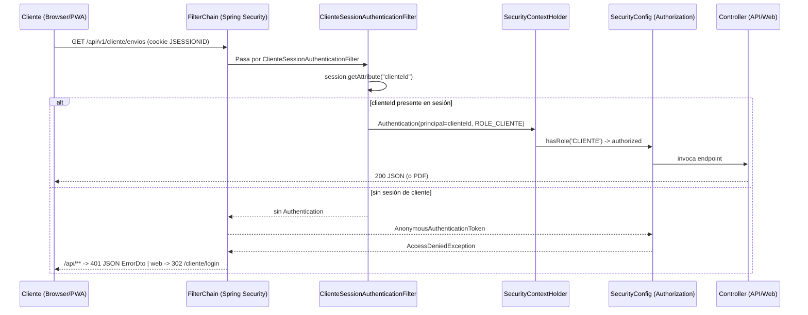
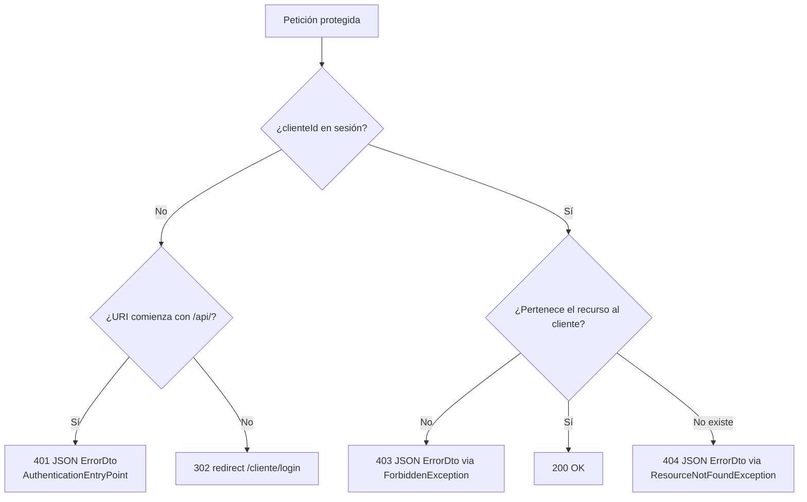

# Especificación Técnica — Seguridad API Cliente + Push (P1.3 + P1.4)

**Fecha:** 2026-08-07
**Repositorio:** `DAW1BSergiomg26/Envios_Paraguay_CMS`
**Rama base:** `main`
**Estado:** Aprobado por el equipo (fase de brainstorming completada)

---

## 1. Resumen Ejecutivo

El hito **P1.3 + P1.4** del `docs/HARDENING_BACKLOG_ENVIOS_CMS.md` endurece la autenticación del
portal de cliente (panel web `/cliente/**` y API REST `/api/v1/cliente/**`) integrándolo en el
filter chain de Spring Security mediante un **filtro de autenticación ligero**, y desacopla el
endpoint de demo `/api/v1/push/test` del perfil activo mediante una **propiedad desactivable**.

### Deuda de seguridad detectada (estado actual)

| Ruta | Estado actual | Riesgo |
|---|---|---|
| `/cliente/**` | Validación manual de `HttpSession` en cada controller | Panel abierto a nivel de Spring Security (`.anyRequest().permitAll()`) |
| `/api/v1/cliente/**` | Validación manual de `clienteId` en cada endpoint (403) | API abierta a nivel de Spring Security |
| `/api/v1/push/test` | Gate manual por cadena de perfil (`spring.profiles.active`) | Dependencia frágil de una cadena; no cubierto por la security chain |

### Decisiones aprobadas (de la fase de brainstorming)

1. **Modelo de autenticación:** filtro ligero (`OncePerRequestFilter`) que crea un
   `Authentication` con authority `ROLE_CLIENTE` a partir de `clienteId` en sesión. **Sin**
   migración a Spring Security full para clientes (no hay password BCrypt en la tabla `clientes`).
2. **Alcance:** endurecer tanto la API REST como el panel web del cliente.
3. **Endpoint `/api/v1/push/test`:** propiedad `app.push.test-enabled` (default `true` en dev,
   `false` en prod) en lugar de la comparación de perfiles.

---

## 2. Objetivos y No-Objetivos

### Objetivos

- Proteger `/cliente/**` y `/api/v1/cliente/**` a nivel de Spring Security con `ROLE_CLIENTE`.
- Centralizar la autenticación de cliente en un único filtro, eliminando la validación manual
  repetida en controllers.
- Responder **401 JSON** para la API no autenticada y **redirect a `/cliente/login`** para el
  panel web no autenticado, unificando la estrategia de manejo de excepciones de seguridad.
- Preservar los checks de ownership (403/404) ya existentes en `ClienteApiController` y
  `ClientDashboardController`.
- Desacoplar `/api/v1/push/test` de la cadena de perfil activo.
- Cobertura TDD de los nuevos componentes de seguridad.

### No-Objetivos

- **No** migrar el login de clientes a `UserDetailsService`/`AuthenticationManager` de Spring
  Security (requeriría migrar credenciales y cambia el contrato de login existente).
- **No** cambiar el modelo de login web `/cliente/login` (sigue escribiendo `clienteId` y
  `clienteNombre` en `HttpSession`).
- **No** eliminar el endpoint `/api/v1/push/test` (sigue disponible para demos en dev).
- **No** refactorizar `/subscribe` y `/unsubscribe` de push (públicos por diseño de la PWA).

---

## 3. Arquitectura de Seguridad

### 3.1 Flujo de autenticación del cliente (nuevo modelo)



### 3.2 Matriz de autorización resultante

| Ruta | Requisito | Respuesta no autenticado | Respuesta autenticado |
|---|---|---|---|
| `/cliente/panel`, `/cliente/panel/envio/{codigo}/etiqueta` | `ROLE_CLIENTE` | 302 → `/cliente/login` | 200 (vista / PDF) |
| `/api/v1/cliente/envios`, `/envios/{codigo}`, `/evidencias/{id}/archivo` | `ROLE_CLIENTE` | 401 JSON `ErrorDto` | 200 JSON / recurso |
| `/api/v1/push/test` | `permitAll` + `app.push.test-enabled` | 200 (si enabled) / 403 (si disabled) | igual |
| `/api/v1/push/subscribe`, `/unsubscribe` | `permitAll` | 200 | 200 |
| `/admin/**`, `/api/v1/admin/**`, `/api/v1/deliveries/**` | `authenticated` (admin) | sin cambio | sin cambio |

### 3.3 Flujo de respuesta de error unificado



---

## 4. Desglose Técnico por Sección

### Sección 1 — `ClienteSessionAuthenticationFilter` (nuevo)

**Archivo:** `src/main/java/com/monteastur/envios/security/ClienteSessionAuthenticationFilter.java`

**Responsabilidad:** Si la `HttpSession` contiene `clienteId` y el `SecurityContext` no tiene una
autenticación previa, crea y fija una `Authentication` con la authority `ROLE_CLIENTE`.

**Requisitos funcionales (RF):**

- `RF-1.1` — Si `session.getAttribute("clienteId")` es `Long` y no existe autenticación previa,
  fijar `SecurityContextHolder.getContext().setAuthentication(...)` con:
  - `principal` = `clienteId` (Long)
  - `authorities` = `[ROLE_CLIENTE]`
  - `authenticated = true`
- `RF-1.2` — Si no hay `clienteId` en sesión, **no** fijar autenticación (flujo anónimo normal).
- `RF-1.3` — Si ya existe autenticación (p. ej. sesión de admin), **no** sobrescribirla.
- `RF-1.4` — **Sin acceso a BD**: no consulta `ClienteService` ni repositorios (rendimiento;
  la baja de un cliente invalida la sesión en el flujo de logout/borrado).
- `RF-1.5` — Extender `OncePerRequestFilter` (garantiza ejecución única por request).

**Pseudo-código de referencia:**

```java
@Component
public class ClienteSessionAuthenticationFilter extends OncePerRequestFilter {

    public ClienteSessionAuthenticationFilter() {
        // inyección vacía por constructor (patrón del proyecto)
    }

    @Override
    protected void doFilterInternal(HttpServletRequest request,
                                    HttpServletResponse response,
                                    FilterChain filterChain) throws ServletException, IOException {
        Authentication existing = SecurityContextHolder.getContext().getAuthentication();
        if (existing == null || !existing.isAuthenticated()) {
            HttpSession session = request.getSession(false);
            if (session != null && session.getAttribute("clienteId") instanceof Long clienteId) {
                Authentication auth = new UsernamePasswordAuthenticationToken(
                        clienteId, null, List.of(new SimpleGrantedAuthority("ROLE_CLIENTE")));
                SecurityContextHolder.getContext().setAuthentication(auth);
            }
        }
        filterChain.doFilter(request, response);
    }
}
```

**Nota de convención:** el proyecto usa inyección por constructor; aunque este filtro no
necesita dependencias hoy, el constructor se declara explícitamente. **No usar Lombok.**

### Sección 2 — `SecurityConfig` (actualización)

**Archivo:** `src/main/java/com/monteastur/envios/config/SecurityConfig.java`

**Cambios:**

1. Añadir a `authorizeHttpRequests`, antes de `anyRequest().permitAll()`:

   ```java
   .requestMatchers("/cliente/**", "/api/v1/cliente/**").hasRole("CLIENTE")
   ```

2. Registrar el filtro en el chain (antes del filtro de autenticación por username):

   ```java
   http.addFilterBefore(clienteSessionAuthenticationFilter, UsernamePasswordAuthenticationFilter.class);
   ```

3. Declarar el bean del filtro en el método `filterChain` como parámetro (inyección por
   constructor) o como `@Bean` explícito. **Elección:** parámetro del método `filterChain`
   (Spring lo inyecta por constructor; coincide con el patrón ya usado con
   `CustomAccessDeniedHandler`).

4. Añadir `authenticationEntryPoint` para distinguir 401 API vs redirect web:

   ```java
   .exceptionHandling(handling -> handling
       .accessDeniedHandler(customAccessDeniedHandler)
       .authenticationEntryPoint(new RestAuthenticationEntryPoint())
   )
   ```

**Nuevo componente:** `src/main/java/com/monteastur/envios/security/RestAuthenticationEntryPoint.java`
implementando `AuthenticationEntryPoint`:

- Si `request.getRequestURI().startsWith("/api/")` → responder **401 JSON** con `ErrorDto`
  (timestamp, `status=401`, mensaje `"Acceso no autenticado"`), `Content-Type: application/json`.
- En caso contrario → `response.sendRedirect("/cliente/login")`.

**Nota sobre `CustomAccessDeniedHandler`:** se mantiene sin cambios para los **403 de negocio
por ownership** (emitidos como `ForbiddenException` → `GlobalExceptionHandler`). El caso "no
autenticado" lo absorbe el `RestAuthenticationEntryPoint`, no el denied handler.

### Sección 3 — `ClienteApiController` (refactor)

**Archivo:** `src/main/java/com/monteastur/envios/controller/api/ClienteApiController.java`

**Cambios:**

1. Eliminar los 3 bloques manuales `clienteId == null → 403` (de `listarEnvios`,
   `detalleEnvio` y `descargarEvidencia`). Ahora el filtro garantiza autenticación; el acceso
   anónimo se corta en la security chain con 401.
2. Obtener el `clienteId` autenticado desde el `Authentication`:

   ```java
   @GetMapping("/envios")
   public ResponseEntity<?> listarEnvios(Authentication authentication) {
       Long clienteId = (Long) authentication.getPrincipal();
       // ...
   }
   ```

   (Spring inyecta el `Authentication` actual en el parámetro del método cuando el controller
   se invoca desde el contexto de seguridad.)
3. **Preservar** los checks de ownership en `detalleEnvio` y `descargarEvidencia`:
   - Envío inexistente → `ResourceNotFoundException` (404).
   - Envío ajeno al cliente → 403 JSON (se mantiene el patrón `ErrorDto` actual, o se puede
     migrar a `ForbiddenException` para unificar; **elección:** migrar a `ForbiddenException`
     para delegar en `GlobalExceptionHandler` y eliminar la duplicación de `ErrorDto`).
   - Evidencia no visible (`visibleCliente != true`) → 403.
   - Path traversal (`..`, `/`, `\`) → 403.
   - Archivo inexistente/no legible → 404.
4. Actualizar la anotación `@ApiResponse(responseCode = "401")` (antes 403 "No autenticado")
   en Swagger de los tres endpoints, describiendo: 401 = no autenticado, 403 = no autorizado
   (ownership), 404 = no encontrado.

### Sección 4 — `ClientDashboardController` (refactor)

**Archivo:** `src/main/java/com/monteastur/envios/controller/web/ClientDashboardController.java`

**Cambios:**

1. Eliminar el helper privado `clienteAutenticado(HttpSession)` y la dependencia directa de
   `HttpSession` en `panel` y `descargarEtiqueta`.
2. Obtener el `clienteId` del `Authentication` (mismo patrón que la Sección 3).
3. `panel(Authentication auth, Model model)`:
   - Si el filtro garantiza autenticación, la rama `redirect:/cliente/login` desaparece.
   - Cargar dashboard con `clienteId` del principal.
   - **Opción de seguridad (mantener):** validar que el `Cliente` aún existe vía
     `clienteService.buscarPorId` — la spec propone conservar esta validación **solo** aquí
     (es el único lugar que ya la hacía) para no degradar el comportamiento de "cliente
     borrado → sesión inválida". El filtro no hace hit a BD (RF-1.4); el controller sí puede
     hacerlo puntualmente donde ya lo hacía. Si el cliente no existe → `session.invalidate()`
     y redirect a login (se conserva comportamiento previo).
4. `descargarEtiqueta(@PathVariable codigo, Authentication auth)`:
   - Ownership del envío → si no es del cliente → `ForbiddenException` (403, ya usado).
   - Envío inexistente → `ResourceNotFoundException` (404, ya usado).

### Sección 5 — `/api/v1/push/test` (desacoplamiento por propiedad)

**Archivos:**
- `src/main/resources/application.properties`
- `src/main/resources/application-prod.properties`
- `src/main/java/com/monteastur/envios/controller/api/PushSubscriptionController.java`

**Cambios:**

1. Nueva propiedad en `application.properties` (bloque de notificaciones):

   ```properties
   # =========================
   # PUSH / NOTIFICACIONES PWA
   # =========================
   # Habilita el endpoint de demo POST /api/v1/push/test (false en producción)
   app.push.test-enabled=${APP_PUSH_TEST_ENABLED:true}
   ```

2. En `application-prod.properties`:

   ```properties
   app.push.test-enabled=${APP_PUSH_TEST_ENABLED:false}
   ```

3. Refactor de `PushSubscriptionController`:

   - Eliminar el campo `@Value("${spring.profiles.active:default}") private String activeProfile;`.
   - Añadir `@Value("${app.push.test-enabled:true}") private boolean testEnabled;`
     (o recibirlo por constructor — ver nota de convención).
   - `testPush()`: si `!testEnabled` → 403 JSON (mismo cuerpo actual `ErrorDto`-style
     `Map.of("error", "Push test endpoint disabled")`); si `true` → 200 simulado.

**Convención (inyección por constructor):** para evitar `@Value` en campo (el proyecto evita
`@Autowired` en campos; aunque `@Value` en campo es frecuente, la práctica del repo es
constructor), la spec propone inyectar la propiedad por constructor:

```java
public PushSubscriptionController(@Value("${app.push.test-enabled:true}") boolean testEnabled) {
    this.testEnabled = testEnabled;
}
```

Si el repo ya usa `@Value` en campos en otros controllers, se respeta el estilo existente;
**decisión final en implementación** tras el pre-flight scan.

### Sección 6 — Estrategia de Tests (TDD)

Todos los tests usan `MockMvc` con `@WebMvcTest` + `@Import({GlobalExceptionHandler.class,
SecurityConfig.class})`, `AssertJ`/Matchers de MockMvc, y mocks de repositorios/servicios con
`@MockBean`. **No requieren infraestructura (MySQL/Redis/Docker).**

#### 6.1 Nuevo `ClienteApiControllerTest`

`src/test/java/com/monteastur/envios/controller/api/ClienteApiControllerTest.java`

Contexto: `@WebMvcTest(ClienteApiController.class)`. Mocks: `EnvioTrackingRepository`,
`ClienteService`, `EvidenciaEnvioService`, `EventoTrackingService`, `DataSource`,
`RBACAccessLogger`, `CustomAccessDeniedHandler`. `@TestPropertySource` con
`app.admin.username`/`app.admin.password` y `app.upload.dir`.

| # | Caso | Request | Esperado |
|---|---|---|---|
| T1.1 | API sin sesión → 401 JSON | `GET /api/v1/cliente/envios` | `status 401`, `jsonPath("$.status").value(401)` |
| T1.2 | Envíos con sesión → 200 lista | `GET` con `sessionAttr("clienteId", 7L)` | `status 200`, lista de `ClienteEnvioResumenDto` |
| T1.3 | Detalle de envío propio → 200 | `GET /api/v1/cliente/envios/MT-1` | `status 200`, `jsonPath("$.codigoUnico")` |
| T1.4 | Detalle de envío inexistente → 404 | `GET .../MT-NOPE` (repo vacío) | `status 404` |
| T1.5 | Detalle de envío ajeno → 403 | `GET .../MT-1` con cliente de otro | `status 403` |
| T1.6 | Evidencia no visible → 403 | `GET /api/v1/cliente/evidencias/1/archivo` | `status 403` |
| T1.7 | Evidencia de envío ajeno → 403 | idem con envío de otro cliente | `status 403` |
| T1.8 | Evidencia inexistente → 404 | `evidenciaService.buscar` → empty | `status 404` |
| T1.9 | Path traversal → 403 | URL de archivo `../secret` | `status 403` |
| T1.10 | Archivo no legible → 404 | `UrlResource` no existe | `status 404` |
| T1.11 | Archivo válido → 200 bytes | recurso legible | `status 200`, `Content-Type` correcto |

#### 6.2 Actualización `SecurityConfigTest`

`src/test/java/com/monteastur/envios/config/SecurityConfigTest.java`

Añadir (el test actual usa `@WebMvcTest(controllers = {PushSubscriptionController.class})` —
se actualiza para incluir los casos de cliente con un controller de cliente mockeado o se
crea un `ClienteApiControllerTest` dedicado que cubra la cadena):

| # | Caso | Request | Esperado |
|---|---|---|---|
| T2.1 | `/api/v1/cliente/envios` sin sesión → 401 JSON | `GET`, `Accept: application/json` | `status 401` |
| T2.2 | `/cliente/panel` sin sesión → redirect login | `GET`, `Accept: text/html` | `status 302`, `redirectedUrl("/cliente/login")` |
| T2.3 | `/api/v1/push/test` con `app.push.test-enabled=false` → 403 | `POST` | `status 403` |
| T2.4 | `/api/v1/push/test` con `app.push.test-enabled=true` → 200 | `POST` | `status 200` |
| T2.5 | `/api/v1/push/subscribe` público → 200 | `POST` | `status 200` (sin cambios) |

**Nota:** T2.3/T2.4 requieren `@TestPropertySource` por clase (no se pueden alternar en el
mismo contexto). Se crean **dos clases** o se usa `@Nested` con `@TestPropertySource` a nivel
de clase anidada (Spring soporta properties heredadas por clase anidada).

#### 6.3 Actualización `ClientDashboardControllerTest`

`src/test/java/com/monteastur/envios/controller/web/ClientDashboardControllerTest.java`

Ajustes:

- El caso `panel_sinSesion_redirigeLogin` sigue verde (302 → `/cliente/login`) — ahora
  resuelto por el `RestAuthenticationEntryPoint` en lugar del controller.
- `panel_conSesion_retornaDashboard`: usar `sessionAttr("clienteId", 7L)` (sin cambios).
- `panel_clienteInexistente_redirigeLogin`: se mantiene si se conserva la validación de
  existencia en el controller (Sección 4, opción de seguridad).
- `etiqueta_sinSesion_redirigeLogin`: ahora 302 vía entry point (mismo resultado).
- `etiqueta_envioPropio_retornaPdf`, `etiqueta_envioAjeno_retorna403`,
  `etiqueta_envioInexistente_retorna404`: sin cambios funcionales.

**Nuevo caso añadido:** `apiClienteSinSesion_retorna401` (cubierto en T2.1, no duplicado aquí).

#### 6.4 Actualización `PushSubscriptionControllerTest`

`src/test/java/com/monteastur/envios/controller/api/PushSubscriptionControllerTest.java`

| # | Caso | Esperado |
|---|---|---|
| T4.1 | `testPush` con `app.push.test-enabled=true` → 200 | `status 200` |
| T4.2 | `testPush` con `app.push.test-enabled=false` → 403 | `status 403` |
| T4.3 | `subscribe` → 200 | `status 200` |
| T4.4 | `unsubscribe` → 200 | `status 200` |

---

## 5. Convenciones del Proyecto Aplicadas

- **Inyección por constructor:** todos los componentes y controllers nuevos usan campos
  `private final` + constructor. Sin `@Autowired` en campos. Sin Lombok.
- **Java puro:** entidades/DTOs con getters/setters manuales.
- **MVC / separación de capas:** los controllers no acceden a repositorios para autenticación;
  el ownership se valida en la capa de controller/dominio existente.
- **Respuestas de error unificadas:** `ErrorDto` para `/api/**`, plantillas `error`/`en/error`
  para MVC — gestionado por `GlobalExceptionHandler` y el nuevo `RestAuthenticationEntryPoint`.
- **TDD:** los tests se escriben antes/paralelos a la implementación; suite sin infraestructura
  externa (MockMvc + mocks).

## 6. Archivos Afectados

**Nuevos:**
- `src/main/java/com/monteastur/envios/security/ClienteSessionAuthenticationFilter.java`
- `src/main/java/com/monteastur/envios/security/RestAuthenticationEntryPoint.java`
- `src/test/java/com/monteastur/envios/controller/api/ClienteApiControllerTest.java`
- `src/test/java/com/monteastur/envios/controller/api/PushPushTestPropertyTests.java` (o variante para T2.3/T2.4)

**Modificados:**
- `src/main/java/com/monteastur/envios/config/SecurityConfig.java`
- `src/main/java/com/monteastur/envios/controller/api/ClienteApiController.java`
- `src/main/java/com/monteastur/envios/controller/web/ClientDashboardController.java`
- `src/main/java/com/monteastur/envios/controller/api/PushSubscriptionController.java`
- `src/main/resources/application.properties`
- `src/main/resources/application-prod.properties`
- `src/test/java/com/monteastur/envios/config/SecurityConfigTest.java`
- `src/test/java/com/monteastur/envios/controller/web/ClientDashboardControllerTest.java`
- `src/test/java/com/monteastur/envios/controller/api/PushSubscriptionControllerTest.java`

## 7. Criterios de Aceptación

1. `GET /api/v1/cliente/envios` sin sesión → **401 JSON** con `ErrorDto`.
2. `GET /api/v1/cliente/envios` con `clienteId` en sesión → **200** lista de envíos.
3. `GET /cliente/panel` sin sesión → **302** a `/cliente/login`.
4. Envío ajeno / evidencia no visible → **403**; inexistente → **404** (comportamiento previo intacto).
5. `POST /api/v1/push/test` con `app.push.test-enabled=false` → **403**; con `true` → **200**.
6. Suite completa (sin infraestructura) en verde: `mvn clean test` con **BUILD SUCCESS**
   (los `*IntegrationTest` requieren Docker/MySQL/Redis y se validan aparte).
7. No se expone ningún secreto ni campo sensible en respuestas.

## 8. Riesgos y Mitigaciones

| Riesgo | Mitigación |
|---|---|
| `@WebMvcTest` con 401 del entry point no configurado | Incluir el `RestAuthenticationEntryPoint` y el filtro en `@Import` de los tests; verificar T2.1. |
| Migrar 403 manuales a `ForbiddenException` cambia el cuerpo del error | Mantener formato `ErrorDto` idéntico (mismo timestamp/status/mensaje) para no romper clientes. |
| La validación de existencia de cliente en el panel añade 1 query por request | Solo en `/cliente/panel` (donde ya existía); no en la API. |
| Cliente borrado con sesión viva | El filtro no autentica contra BD; el panel invalida sesión al detectar cliente inexistente (comportamiento preservado). |
| Tests de perfil alternado (push/test true vs false) | Clases de test separadas con `@TestPropertySource` propio (T2.3/T2.4 y T4.1/T4.2). |

---

*Documento generado a partir del diseño aprobado en la sesión de brainstorming del 2026-08-07.
Próximo paso: ejecución TDD de la Sección 6 (tests) antes de la implementación de las Secciones 1-5.*
