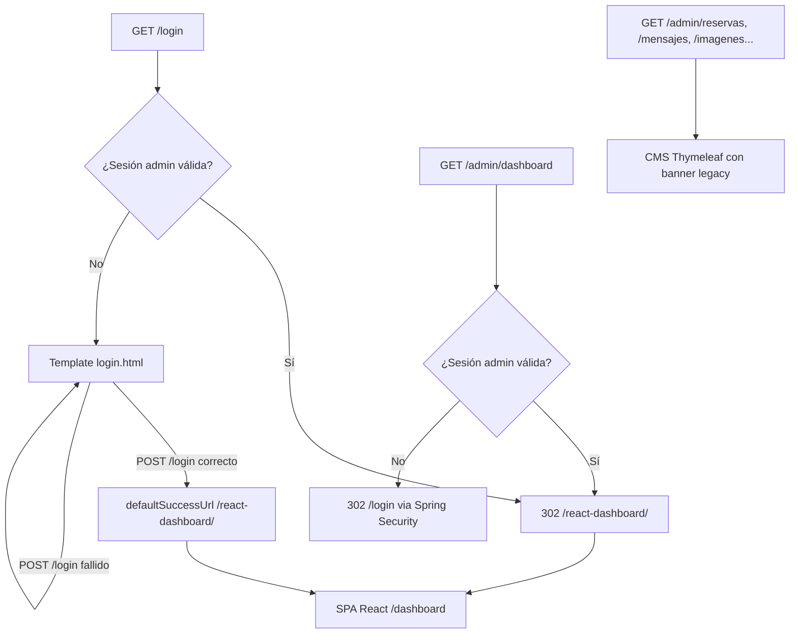

# Especificación Técnica — Arquitectura de Interfaces Thymeleaf + React (P2.2)

**Fecha:** 2026-08-10
**Repositorio:** `DAW1BSergiomg26/Envios_Paraguay_CMS`
**Rama base:** `main`
**Estado:** Aprobado por el equipo (fase de brainstorming completada)

---

## 1. Resumen Ejecutivo

El ítem **P2.2** del `docs/HARDENING_BACKLOG_ENVIOS_CMS.md` documenta qué pantallas de la
aplicación son **oficiales, legacy o complementarias**, porque coexisten templates Thymeleaf
(web pública, CMS, zona cliente) con un dashboard React compilado en `static/react-dashboard`.
El riesgo declarado es *"Duplicidad de interfaz o confusión sobre flujo oficial"*.

Tras la fase de brainstorming se aprobaron estas decisiones:

1. **La SPA React (`/dashboard`) es el panel admin oficial.** El CMS Thymeleaf (`/admin/**`)
   es **legacy en migración**: se mantiene accesible mientras no exista equivalente React.
2. **El estado final es consolidar TODA la gestión admin en React** (envíos/tracking hoy;
   reservas, contactos, imágenes, textos, imports y documentos en fases futuras).
3. **El resto de interfaces Thymeleaf son oficiales:** web pública (`/`, `/casa`, `/contacto`,
   `/reservas`, `/operaciones`, textos legales), portal de tracking (`/tracking`) y zona
   cliente (`/cliente`).
4. **Alcance de P2.2:** documentación + hoja de migración **+ redirecciones mínimas**:
   - `GET /login` con sesión admin activa → `redirect:/react-dashboard/`.
   - `GET /admin/dashboard` → `redirect:/react-dashboard/` (con sesión).
   - Banner "interfaz heredada / en migración" en todas las páginas del CMS (`admin-sidebar`).
   - El resto de rutas `/admin/**` siguen accesibles (gestión de contenido sin equivalente React).

### Estado actual (antes del cambio)

| Interfaz | Rutas | Controller / SPA | Estatus |
|---|---|---|---|
| Web pública Thymeleaf | `/`, `/en`, `/casa`, `/lacasa` (301), `/entorno`, `/reservas`, `/contacto`, `/operaciones`, `/aviso-legal`, `/politica-cookies` | `PublicController` | Oficial |
| Portal tracking | `/tracking`, `/en/tracking`, `/tracking/{codigo}` | `TrackingWebController` | Oficial |
| Zona cliente | `/cliente/login`, `/cliente/panel`, etiqueta PDF | `ClienteController`, `ClientDashboardController` | Oficial |
| Login compartido | `/login`, `/admin/login` | `LoginController` (template `login.html`) | Complementaria |
| **CMS admin (legacy)** | `/admin/dashboard`, `/admin/reservas`, `/admin/mensajesrecibidos`, `/admin/imagenes`, `/admin/textos`, `/admin/tracking`, `/admin/imports`, `/admin/documentos`, `/admin/tracking/nuevo`, `/admin/tracking/editar/{id}` | `AdminController` → `cms/*.html` | **Legacy en migración** |
| **Dashboard React (oficial)** | `/login-react`, `/dashboard`, `/dashboard/envio/{codigo}` | SPA `frontend-react` (App.jsx) → `forward:/react-dashboard/index.html` | **Oficial (admin)** |
| APIs REST | `/api/v1/**` | 11 REST controllers | Oficial |

---

## 2. Objetivos y No-Objetivos

### Objetivos

- Eliminar la ambigüedad sobre el flujo admin oficial: **el panel React es la puerta de
  entrada del admin**; el CMS Thymeleaf es secundario y en migración.
- Documentar la matriz de estatus (oficial/legacy/complementaria) en un documento versionable
  y la hoja de ruta de migración del CMS → SPA.
- Redirigir el flujo de login y el dashboard admin al panel React cuando hay sesión válida,
  sin romper la gestión de contenido que aún no tiene equivalente React.
- Señalar visualmente en el CMS que es una interfaz heredada (banner en `admin-sidebar`).
- Mantener el 100% de la funcionalidad actual accesible (zero-regression).
- Cobertura TDD de los cambios de routing y del banner.

### No-Objetivos

- **No** redirigir todas las rutas `/admin/**` al panel React (rompería reservas, mensajes,
  imágenes, textos, imports y documentos que aún no tienen pantalla React).
- **No** implementar en este ítem las nuevas pantallas React de reservas/contactos/contenido
  (son fases futuras de la hoja de migración, fuera del alcance de P2.2).
- **No** eliminar ni renombrar rutas existentes de la web pública, tracking o zona cliente.
- **No** cambiar el modelo de autenticación (la SPA ya comparte la sesión Spring Security vía
  cookie `JSESSIONID`; no se introduce JWT).

---

## 3. Arquitectura de Interfaces

### 3.1 Clasificación resultante (documentada en `docs/ARQUITECTURA_INTERFACES.md`)

| Interfaz | Estatus | Justificación |
|---|---|---|
| SPA React `/dashboard` | **Oficial** | Panel admin moderno: envíos, filtros, analytics, PWA/offline. Sesión Spring compartida. |
| Web pública `/`, `/casa`, `/contacto`, `/reservas`, `/operaciones`, legales | **Oficial** | Cara pública del negocio; Thymeleaf es el stack correcto para SSR/SEO. |
| Portal tracking `/tracking` | **Oficial** | Rastreo público en línea con la marca; Thymeleaf moderno. |
| Zona cliente `/cliente` | **Oficial** | Login propio por `clienteId`; panel con dashboard cacheado y etiqueta PDF. |
| Login `/login` | **Complementaria** | Soporta ambos flujos (form clásico y login React) mediante la misma sesión. |
| CMS `/admin/**` | **Legacy en migración** | Gestión de contenido/reservas sin equivalente React aún; se depreca por fases. |
| APIs `/api/v1/**` | **Oficial** | Contrato de datos para SPA, portal y clientes. |

### 3.2 Flujo de acceso del admin (post-cambio)



### 3.3 Hoja de migración CMS → SPA (fases, documentadas)

| Fase | Contenido | Equivalente React | Estado |
|---|---|---|---|
| F1 | Envíos, tracking, detalle, analytics, export | `AdminDashboard`, `ShipmentDetailPage`, APIs `/api/v1/admin/*` | **Hecho (P2.3)** |
| F2 | Importación batch (CSV) y su monitorización | Nueva página React sobre `BatchImportController` | Pendiente |
| F3 | Documentos / evidencias | Nueva página React sobre `DocumentosController`/`EntregaEvidenciaController` | Pendiente |
| F4 | Reservas y contactos (mensajes) | Nueva página React sobre `ReservaApiController` | Pendiente |
| F5 | Imágenes (galería) y textos legales | Nueva página React sobre `AdminApiController` | Pendiente |
| F6 | Deprecación: `/admin/**` → redirect total a `/dashboard` + borrado de templates `cms/*.html` | — | Pendiente |

**Regla de convivencia durante la migración:** ninguna funcionalidad del CMS se bloquea; cada
fase añade su equivalente React y solo entonces la ruta `/admin/**` correspondiente pasa a
legacy inaccesible. El banner de la sección 3.4 indica el estatus actual.

### 3.4 Banner "interfaz heredada"

Se añade al fragment `admin-sidebar.html` (heredado por todas las páginas `cms/*.html`):

- Texto: *"Interfaz heredada — La gestión de envíos se realiza en el Nuevo Panel"*.
- Enlace al nuevo panel: `/react-dashboard/`.
- Estilo visual discreto (caja con fondo acorde a la paleta existente) para no romper el
  diseño del CMS.

---

## 4. Desglose Técnico por Sección

### Sección 1 — `docs/ARQUITECTURA_INTERFACES.md` (nuevo documento)

**Archivo:** `docs/ARQUITECTURA_INTERFACES.md`

**Contenido (en español, nomenclatura de rutas en inglés como convención del repo):**

- Sección 1: Visión general — motivo del modelo híbrido (SSR Thymeleaf para marketing/SEO,
  SPA para aplicación admin).
- Sección 2: Matriz completa de interfaces con estatus (oficial/legacy/complementaria) y
  controladores implicados.
- Sección 3: Modelo de autenticación (sesión Spring compartida, CSRF, roles ADMIN/CLIENTE,
  cómo la SPA verifica sesión vía `/api/v1/admin/envios`).
- Sección 4: Hoja de ruta de migración (fases F1–F6 de la sección 3.3) con criterios de
  promoción de cada fase.
- Sección 5: Reglas de convivencia y referencia cruzada al backlog (`docs/HARDENING_BACKLOG_ENVIOS_CMS.md`).

### Sección 2 — `SecurityConfig` (actualización)

**Archivo:** `src/main/java/com/monteastur/envios/config/SecurityConfig.java`

Cambio único en el bloque `formLogin`:

```java
.formLogin(form -> form
    .loginPage("/login")
    .defaultSuccessUrl("/react-dashboard/")
    .permitAll()
)
```

**Justificación:** el cliente React comparte sesión y su login (LoginPage) hace POST a `/login`
con CSRF; tras autenticarse, la SPA navega por sí misma a `/`. El formulario clásico de
`login.html` (si se usa) también aterriza ahora en el panel React, que es el flujo oficial.

### Sección 3 — `LoginController` (actualización)

**Archivo:** `src/main/java/com/monteastur/envios/controller/LoginController.java`

Si ya existe una autenticación admin en el `SecurityContext`, `GET /login` redirige al panel
React en lugar de mostrar el formulario:

```java
@GetMapping("/login")
public String login(Authentication authentication) {
    if (authentication != null && authentication.isAuthenticated()
            && authentication.getAuthorities().stream()
                .anyMatch(a -> a.getAuthority().equals("ROLE_ADMIN"))) {
        return "redirect:/react-dashboard/";
    }
    return "login";
}
```

**Nota:** el `ClienteSessionAuthenticationFilter` puede fijar `ROLE_CLIENTE`; por eso la
condición exige **`ROLE_ADMIN`** para no desviar a clientes logueados hacia el panel admin.

### Sección 4 — `AdminController.dashboard()` (actualización)

**Archivo:** `src/main/java/com/monteastur/envios/controller/AdminController.java`

El método `dashboard()` (líneas 86–95) deja de renderizar `cms/dashboard` y redirige al panel
React. El endpoint requiere `@PreAuthorize`/autenticación admin (ya garantizado por
`.requestMatchers("/admin/**").authenticated()`), así que solo se alcanza con sesión válida:

```java
@GetMapping("/dashboard")
public String dashboard() {
    return "redirect:/react-dashboard/";
}
```

**Nota:** se elimina el bloque de `model.addAttribute(...)` del dashboard legacy; no se tocan
el resto de rutas `/admin/**` (reservas, mensajes, imágenes, textos, tracking, imports,
documentos, tracking/nuevo, tracking/editar/{id}), que siguen sirviendo `cms/*.html`.

### Sección 5 — `admin-sidebar.html` (banner legacy)

**Archivo:** `src/main/resources/templates/fragments/admin-sidebar.html`

Se inserta al inicio del fragment (tras el `sidebar-header`) una caja con:

```html
<div class="legacy-banner">
    <strong>Interfaz heredada</strong>
    <span>La gestión de envíos se realiza en el <a href="/react-dashboard/">Nuevo Panel</a>.</span>
</div>
```

La clase `.legacy-banner` se añade a la hoja de estilos del CMS (se localizará el CSS
existente de `fragments/header.html` o el CSS global usado por el admin) con estilo discreto
coherente con la paleta corporativa (`#d4762a`).

---

## 5. Pruebas (TDD)

### 5.1 `LoginControllerTest` (nuevo)

`src/test/java/com/monteastur/envios/controller/LoginControllerTest.java`
(`@WebMvcTest(LoginController.class)`, mocks de `DataSource`, `RBACAccessLogger`,
`CustomAccessDeniedHandler`):

| # | Caso | Request | Esperado |
|---|---|---|---|
| T1.1 | `/login` sin sesión → template login | `GET /login` | `status 200`, `viewName("login")` |
| T1.2 | `/login` con `ROLE_ADMIN` → redirect panel React | `GET /login` con `@WithMockUser(roles="ADMIN")` | `status 302`, `redirectedUrl("/react-dashboard/")` |
| T1.3 | `/login` con `ROLE_CLIENTE` → template login (no desvía clientes) | `GET /login` con `@WithMockUser(roles="CLIENTE")` | `status 200`, `viewName("login")` |
| T1.4 | `/admin/login` → redirect `/login` | `GET /admin/login` | `status 302`, `redirectedUrl("/login")` |

### 5.2 `AdminControllerTest` (actualización)

En la clase de test existente de `AdminController` (o su equivalente) se ajusta/verifica:

| # | Caso | Request | Esperado |
|---|---|---|---|
| T2.1 | `/admin/dashboard` con sesión admin → redirect panel React | `GET /admin/dashboard` autenticado | `status 302`, `redirectedUrl("/react-dashboard/")` |
| T2.2 | `/admin/dashboard` sin sesión → login (comportamiento Spring Security intacto) | `GET /admin/dashboard` anónimo | `status 302` (hacia `/login`) |
| T2.3 | `/admin/reservas` con sesión → sigue sirviendo el CMS | `GET /admin/reservas` autenticado | `status 200`, `viewName("cms/reservas")` (o equivalente actual) |

### 5.3 `SecurityConfigTest` (actualización)

Verificar que `defaultSuccessUrl` apunta al panel React tras login con credenciales válidas
(usando `@WithMockUser` + `SecurityMockMvcRequestBuilders.formLogin` o el patrón ya existente
en `SecurityConfigTest`):

| # | Caso | Request | Esperado |
|---|---|---|---|
| T3.1 | POST `/login` correcto → redirect `/react-dashboard/` | `POST /login` (formLogin) | `status 302`, `redirectedUrl("/react-dashboard/")` |

### 5.4 Verificación de regresión

- Los tests existentes de `SpaForwardControllerTest` (3/3) permanecen verdes: `/login-react`,
  `/dashboard`, `/dashboard/envio/MT-1` → `forward:/react-dashboard/index.html`.
- `mvn clean test` local (con `& "C:\Users\astur\Desktop\maven\apache-maven-3.9.9\bin\mvn.cmd"`)
  con **BUILD SUCCESS** (los `*IntegrationTest` requieren MySQL/Redis vía Docker y se validan
  aparte).

---

## 6. Convenciones del Proyecto Aplicadas

- **Inyección por constructor:** campos `private final` + constructor; sin `@Autowired` en
  campos; sin Lombok.
- **Java puro:** sin anotaciones de terceros en dominio; getters/setters manuales.
- **TDD:** tests escritos antes/paralelos a la implementación; suite sin infraestructura
  externa (MockMvc + mocks).
- **Documentación en español**, nomenclatura en inglés para clases/métodos.
- **Cambios pequeños y revisables:** un commit por unidad lógica (doc / redirects / banner).

## 7. Archivos Afectados

**Nuevos:**
- `docs/ARQUITECTURA_INTERFACES.md`
- `src/test/java/com/monteastur/envios/controller/LoginControllerTest.java`

**Modificados:**
- `docs/HARDENING_BACKLOG_ENVIOS_CMS.md` (marcar P2.2 cerrado y actualizar "Decision actual")
- `src/main/java/com/monteastur/envios/config/SecurityConfig.java`
- `src/main/java/com/monteastur/envios/controller/LoginController.java`
- `src/main/java/com/monteastur/envios/controller/AdminController.java`
- `src/main/resources/templates/fragments/admin-sidebar.html`
- CSS del CMS (`.legacy-banner`; se localiza la hoja usada por `fragments/header.html`)
- Tests existentes de `AdminController`, `SecurityConfigTest` (según patrón del repo)

## 8. Criterios de Aceptación

1. `docs/ARQUITECTURA_INTERFACES.md` documenta la matriz oficial/legacy/complementaria y la
   hoja de migración F1–F6.
2. `GET /login` con sesión admin → **302** `/react-dashboard/`; con sesión de cliente →
   muestra login (no desvía clientes); anónimo → template `login`.
3. `POST /login` correcto → **302** `/react-dashboard/` (`defaultSuccessUrl`).
4. `GET /admin/dashboard` con sesión → **302** `/react-dashboard/`; anónimo → login.
5. El resto de rutas `/admin/**` siguen respondiendo sus templates `cms/*.html` y muestran el
   banner legacy.
6. `SpaForwardControllerTest` y resto de la suite (sin infraestructura) en verde:
   `mvn clean test` con **BUILD SUCCESS**.
7. Backlog actualizado: P2.2 marcado cerrado y "Decision actual" refleja el nuevo estado.

## 9. Riesgos y Mitigaciones

| Riesgo | Mitigación |
|---|---|
| Redirigir `/admin/dashboard` rompe acceso a los stats legacy | La SPA React ya muestra analytics y métricas de envíos (su equivalente); la migración es la dirección aprobada. |
| Desviar a clientes logueados al panel admin | La condición del `LoginController` exige `ROLE_ADMIN`; caso T1.3 cubierto por test. |
| El banner legacy altera el diseño del CMS | Clase CSS dedicada, discreta, coherente con paleta `#d4762a`; se verifica visualmente en las páginas admin. |
| `defaultSuccessUrl` cambia el flujo del form clásico | Es el flujo deseado (panel React oficial); el login clásico sigue funcionando como fallback. |
| Falta el equivalente React de contenido y alguien intenta migrar antes de tiempo | La hoja F1–F6 define el orden; ninguna ruta `/admin/**` de contenido se redirige en P2.2. |

---

*Documento generado a partir del diseño aprobado en la sesión de brainstorming del 2026-08-10.*
